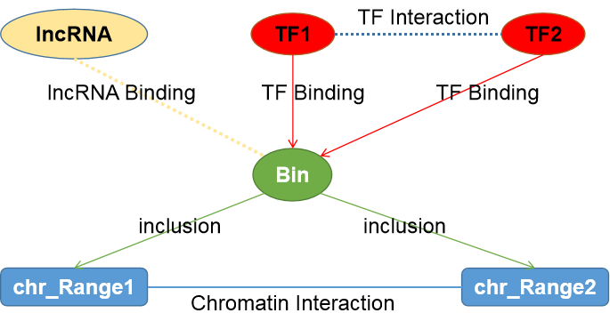

# Installing GREG-minimum

GREG-minuimum neo4j graph database is small version of GREG. We build this for convenient to practice. Here show you an overview of GREG-minuimum database.



After you [installed Neo4j](https://github.com/mora-lab/biographdbs/blob/master/ch02.md), following this instructions, we can import GREG-minuimum database to neo4j for future execises.

1. Download GREG-minuimum from [here](https://github.com/mora-lab/biographdbs/raw/master/GREG-minimum.7z).

2. Unzip this file and put the `GREG-minuimum` folder in `neo4j\data\database` directory.

3. We need edit `neo4j\conf\neo4j.conf` file.  
		Find out `#dbms.active_database=graph.db`, and chage to `dbms.active_database=GREG-minuimum`.
		
4. Restart neo4j as following:  
Open Command Prompt and change the directory to your `neo4j/bin` as like:

```
f:
cd F:\biographdbs\neo4j\bin
```

Now, we can start `neo4j(GREG-minuimum)` as following:  

```
neo4j console
```
See neo4j/GREG-minimum interface when you open http://localhost:7474/browser/ in your browser, if you first log in, you must input your password.

