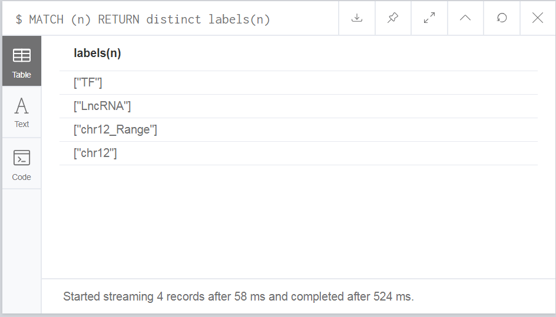
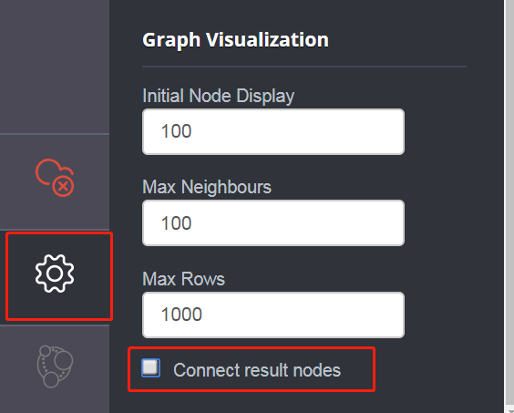
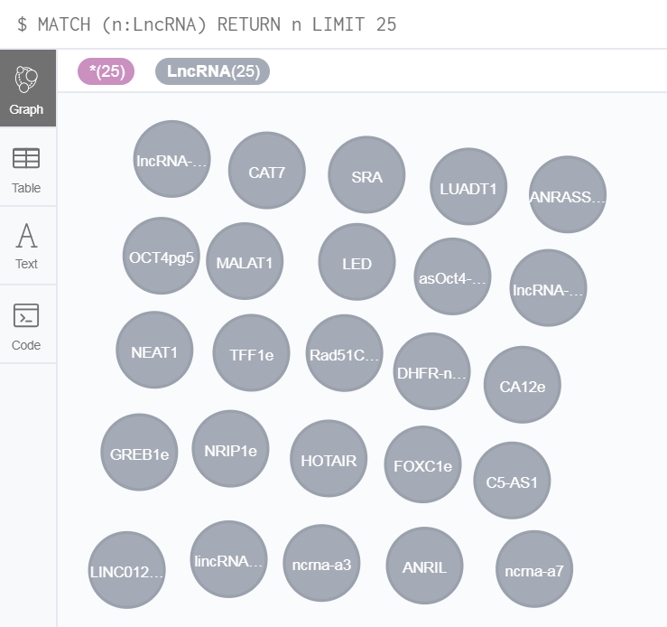
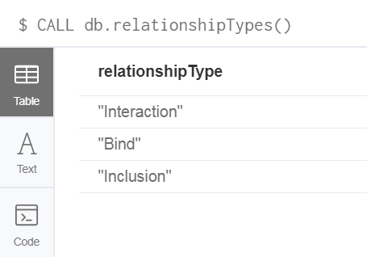
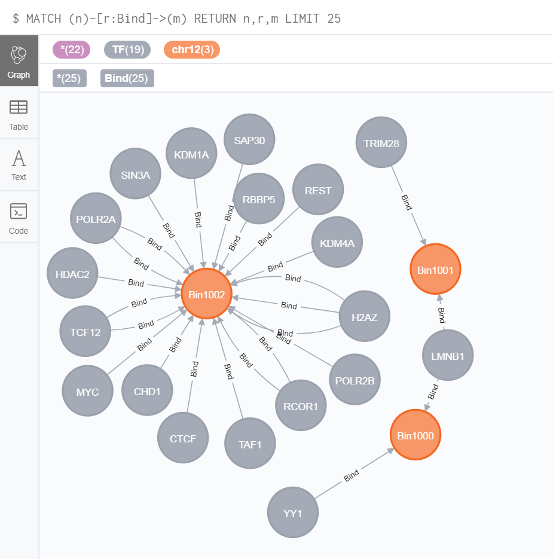

# Retrieving GREG's nodes and relationships using Cypher

## nodes


### List nodes' labels
The first things is to know what the labels are in GREG-minimum database when we 
first use GREG-minimum.  
Here have two cypher commands to get results of list of nodes labels. 
```
MATCH (n) RETURN distinct labels(n)
```

Or we can use other commands to get all nodes' labels:
```
CALL db.labels()
```
The results are as follows:


In this results, we found there have four labels in GREG-minimum.

### Retrieve TF
Now, we retrieve TF nodes by TF labels.
```
MATCH (n:TF) RETURN n LIMIT 25
```
The results are as follows:


The nodes in results included their relationships. If you don't want to show their 
relationships in the graph results, you can set not connect result nodes in setting 
as this pictures. 



**Notes:**  
In this example, `TF` is the label of the nodes.  
`n` is Variable name, used to represent the results obtained.  
`MATCH(n:TF)` selects all nodes with the TF label.   
`LIMIT 25` limits the results to 25 nodes with the TF label.  

The following commands offer a quick exploration to all the other nodes (chr,
chr_range) present in GREG.

**To query chr12 nodes.**
```
MATCH (n:chr12) RETURN n LIMIT 25
```
**To query chr12_Range nodes.**
```
MATCH (n:chr12_Range) RETURN n LIMIT 25
```

### Count TF
We always want to know how many nodes in GREG-minimum or GREG. Here show you an
example to count TF nodes.
```
MATCH (n:TF) RETURN count(n)
```
The results will show you number 261 to tell you there have 261 TFs.

### Retrieve LncRNA 
Just like before, we retrieve LncRNA.
```
MATCH (n:LncRNA) RETURN n LIMIT 25
```
The results are as follows:


### Count LncRNA
```
MATCH (n:LncRNA) RETURN count(n)
```
The results will show you number 35 to tell you there have 35 LncRNA.


## Relationships

Relationships are the database goal. The first thing is to make our know that the
basic query to relationship.

### Retrieve all relationships types
As like before, we need to know what relationshipTypes are in GREG-minimum.  
Command list relationship types:
```
CALL db.relationshipTypes()
```
The results are as follows:  


### Retrieve Bind relationships
Let us see the Bind relationships in the GREG. Command is following:

```
MATCH (n)-[r:Bind]->(m)
RETURN n,r,m LIMIT 25
```

The results are as follows:


The results return 25 relationships if you had been shut down `Connect result nodes`.
Relationships between some nodes are belonging different celltype, so there have relationships more than one between those nodes.

**Notes:**  

1. `(a)-[r]->(b)` pattern is the basic pattern of relationships, `(a)` is start node, `(b)` is the end
node, `[r]` is relationship between a and b, `->` arrow means the relationship has a
direction `(a)` to `(b)` . If we use `(a)-[r]-(b)` pattern. Which means the relationship
between `a` and `b` has no direction.

2. `[r :Bind]` : set the relationship type is Interaction.

Or you can use commands as following to retrieve Bind relationships:

```
MATCH p = (n)-[r:Bind]->(m)
RETURN p LIMIT 25
```

### Count Bind relationships
If we want to know how many are Bind relationship, we can use `count()` to count all Bind relationships or relationships between two kinds nodes.
For example, we count all Bind relationship.

```
MATCH p = (n)-[r:Bind]->(m)
RETURN count(p) 
```

The results will show you number 929768 to tell you there have 929768 Bind relationships.


