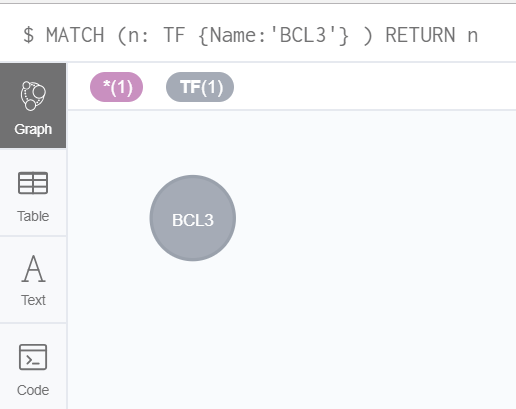
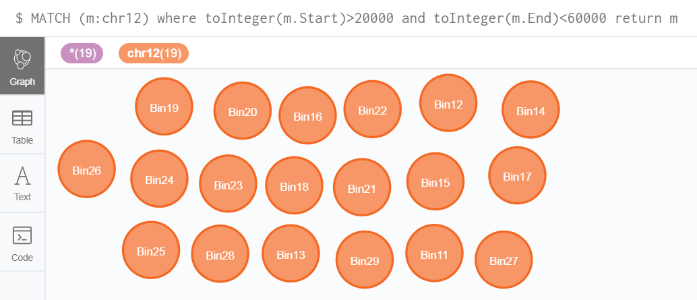
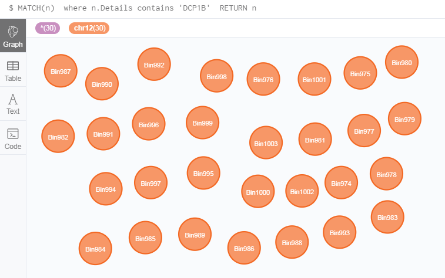
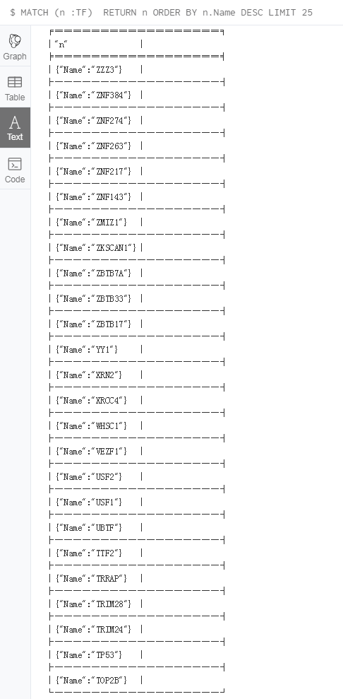
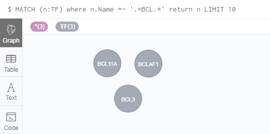

# Queries by property

A node and one relationship always have more property key. For example, `TF` and `LncRNA` only has `Name`
property key, relationships of `TF` Bind `chr12` has `CellType`, `End`, `Start`,`GEO`,`OtherGEO` and `SourceDB` In GREG.

## Query by TF name
When you have transcription factors name, you can get its nodes. Here we show an
example, the transcription factors name is `BCL3`, we can use the command as follows
to get `BCL3` node:

```
MATCH (n: TF {Name:'BCL3'} ) RETURN n
```
The results are as follows:



Also, we can use the following command to get the same result:
```
MATCH (n: TF ) where n.Name = 'BCL3' RETURN n
```

When we want to query a lot of nodes in one time, you can use the `IN` command.
```
MATCH (n:TF) 
where n.Name in ['BCL3', 'ARNT', 'ATF3']
RETURN n
```
The results are as follows:


Also, we can use Boolean operators to get a lot of TF.
```
MATCH (n:TF)
where n.Name = 'BCL3' or n.Name = 'ARNT' or n.Name = 'ATF3'
RETURN n
```

## Query by genomic range

GREG can be used to query all the information associated to a given genomic range
in a specific chromosome.

```
MATCH (m:chr12) where toInteger(m.Start)>20000 and
toInteger(m.End)<60000
return m
```
The results are as follows:



You will get 19 chr12 nodes in this result. Every node has its properties, you can click
this node to see its properties.

## Get nodes in a given DNA annotation

GREG can be used to query all the information associated to a given DNA
annotation.

The example is querying a node including gene `DCP1B`.

```
MATCH(n) 
where n.Details contains 'DCP1B' 
RETURN n
```
The results are as follows:


You can get 30 nodes in this result, it means gene "DCP1B" has long range in chr12.


Or we use following command to query:
```
MATCH(n:chr12) where n.Details contains 'DCP1B' RETURN n
```

## Order the results by property

After you queried, you want order those nodes information to get best, here show an
example that use ORDER BY for ordered the results by property.

```
MATCH (n :TF) 
RETURN n ORDER BY n.Name DESC LIMIT 25
```
The results are as follows:



You will get 25 TF nodes with started letters from z to a.

**Note**:   

`DESC` will make order is descending. If `DESC` didn’t use, we will get 25 nodes
with stared letters from a to z.

## Fuzzy query

GREG can help you to get nodes you don’t remember those full names. Here show you example
to get name of TF nodes having ‘BCL’ letters:
```
MATCH (n:TF) where n.Name =~ '.*BCL.*' return n LIMIT 10
```
The results are as follows:



**Notes:**  

`=~` : represents that the following value is a regular expression.
