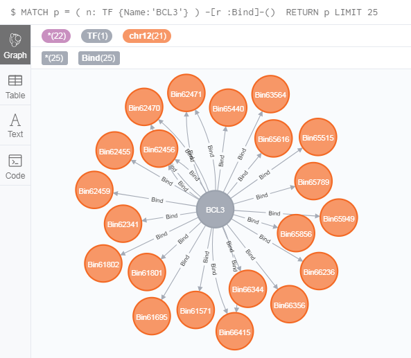
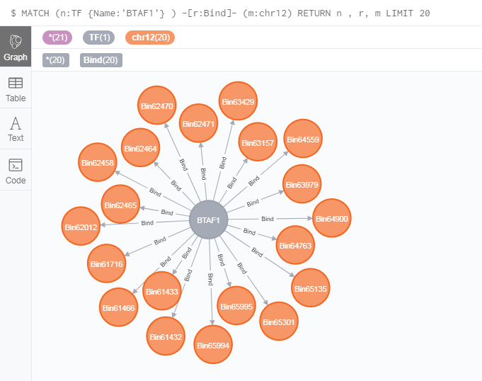
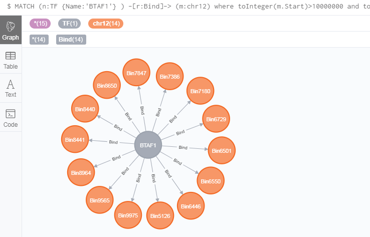
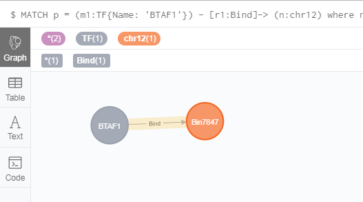

# Single-relationship queries
As we showed in ***Retrieving GREG's nodes and relationships using Cypher***, GREG have three
relationships types. But what genes related others, we will discuss at here.

## Which gene are a TF binding to?
GREG can support to find out Which gene are a TF binding to.

the example is showing the bin nodes which is BCL3 binding to.

You can click the bin nodes to get the gene information.
```
MATCH p = ( n: TF {Name:'BCL3'} ) -[r :Bind]-() 
RETURN p LIMIT 25
```

The results are as follows:



**Notes:**   
`( n: TF {Name:'BCL3'} )` is the same as patterns we match those nodes.

## Which gene in special Chromosome are a TF binding to?
GREG can find out all the gene information in special Chromosome that a TF bind to.

The example here is showing the gene information BTAF1 binding to chr1.

You can click the bin nodes to get the gene information.
```
MATCH (n:TF {Name:'BTAF1'} ) -[r:Bind]- (m:chr12)
RETURN n , r, m LIMIT 20
```
The results are as follows:



## Which gene in genomic range are a TF binding to?
We can query what a TF work in a specific region.

For Example: BTAF1 Bind in chr12: 10000000-20000000.

```
MATCH (n:TF {Name:'BTAF1'} ) -[r:Bind]-> (m:chr12)
where toInteger(m.Start)>10000000 and toInteger(m.End)<20000000
RETURN n , r, m LIMIT 25
```
The results are as follows:



## Is TF BTAF1 binding the gene EPS8?
GREG support you to find out Whether a special gene is a TF binding to .

For Example: Is BTAF1 binding EPS8 in chromosome one.
```
MATCH p = (m1:TF{Name: 'BTAF1'}) - [r1:Bind]-> (n:chr12)
where n.Details contains 'EPS8'
RETURN p
```
The results are as follows:



If there have this relationship, the result will show you like this.  
Or not, you will get `no change, no records`.


