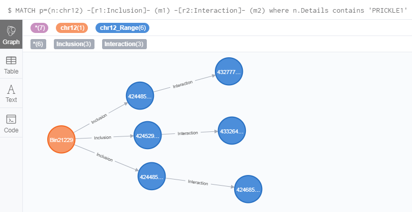
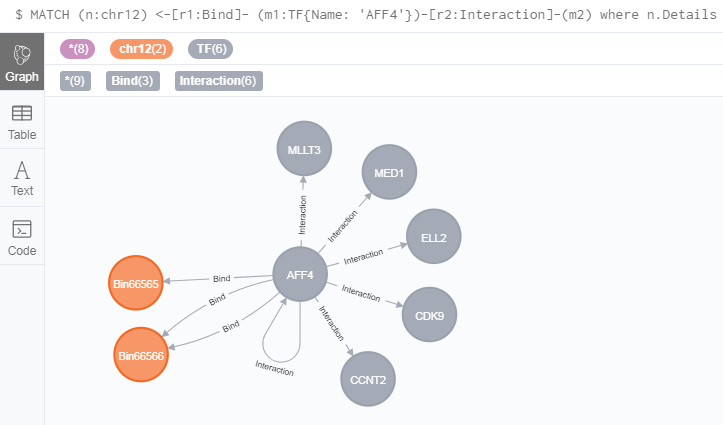
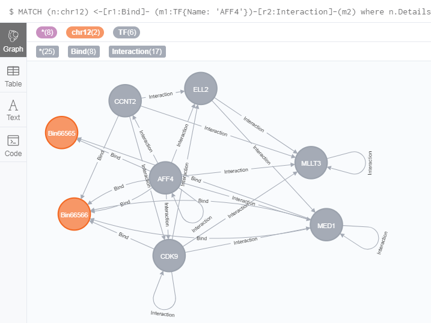
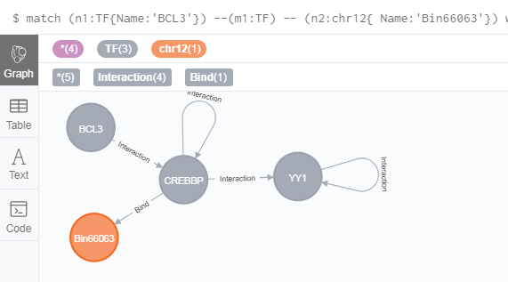
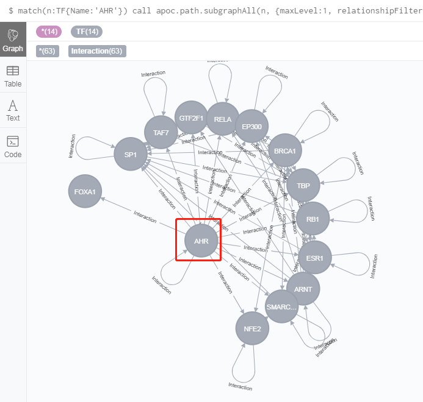

# Multiple-relationship queries

## Get genomic interactions for a special DNA annotation
GREG can support Find the genomic interactions for a special DNA annotation.
The example is to find out the genomic interactions on chromosome 12 of `PRICKLE1`:
```
MATCH p=(n:chr12) -[r1:Inclusion]- (m1) -[r2:Interaction]- (m2)
where n.Details contains 'PRICKLE1' and tointeger(n.Start) < 42494001
RETURN p limit 3
```
The results are as follows:



**Notes:**  
`(n:chr12) -[r1:Inclusion]- (m1)` used to find out which range is "PRICKLE1" in.  
`(m1) -[r2:Interaction]- (m2)` used to find out the genomic interactions.


## Get TFs for a special DNA annotation

GREG allows you find multiple relationships between two nodes that are not directly
related. For example, we find out relationship of two nodes that didn’t have directly
related. One node, which in chr12 annotation contains `ZNF891`, bind related with `AFF4`,
and other nodes also related with `AFF4` as interaction relationship.

```
MATCH (n:chr12) <-[r1:Bind]- (m1:TF{Name: 'AFF4'})-[r2:Interaction]-(m2)
where n.Details contains 'ZNF891'
RETURN n,r1,m1,r2,m2
```
The results are as follows:



Here has two chr12 nodes contains `ZNF891` gene names and 5 TFs bind related with `AFF4`. 

If you select option of cannect results nodes,you will find out only `MLT3` is not directly
related other two chr12 nodes.




## Find multiple nodes related the same nodes
GREG also can help you to get those genes which related more genes.
For example, we found genes, which not only related BCL3 genes and related `Bin66063` node but also 
related YY1 genes.

```
match (n1:TF{Name:'BCL3'}) --(m1:TF) -- (n2:chr12{ Name:'Bin66063'})
with m1, n1, n2
match (m1:TF)--(m2:TF{ Name:'YY1'}) 
return m1,m2,n1,n2 LIMIT 10
```
The results are as follows:



We only found `CREBBP` is related three nodes.

**Notes:**

The first command line is relationship pattern to get results `m1`,`n1` and `n2` as input for next command
line. We always use `with` to connect two or more `match` command.

## SUBGRAPHS

### Install `apoc` and `algo` plugins

Before we perform `SUBGRAPHS`, we need to install `apoc` plugin. And for convenience, we also 
install `algo` plugin for **part3. Network analysis applied to biological databases**. 

1. Download `graph-algorithms-algo-[version].jar` from [the matching release](https://github.com/neo4j-contrib/neo4j-graph-algorithms/releases) and copy it into the `$NEO4J_HOME/plugins ` directory. We can work out which release to download by referring to the versions file.

 	Download `apoc-[version-all].jar` from [the matching release](https://github.com/neo4j-contrib/neo4j-apoc-procedures/releases/) and copy it into the `$NEO4J_HOME/plugins ` directory. We can work out which release to download by referring to the versions file.
 
 **Note:**

You must download the release versions file which corresponds to your neo4j.  Otherwise, you will do not start neo4j.

2. Add the following command to your `$NEO4J_HOME/conf/neo4j.conf` file:

```
dbms.security.procedures.unrestricted=algo.*,apoc.*
```
  We need to give the library unrestricted access because the algorithms use the lower level Kernel API to read from, and to write to Neo4j.

3. Restart `Neo4j/GREG-minimum`.

4. Verifying installation

     Once we’ve installed the library, to check whether those algorithms are working, run the following query:
	
	`apoc` plugin
	```
	 return apoc.version()
	 ```	 
	 
	 `algo` plugin
	 ```
	 CALL algo.list()
	 ```
	 


### Subgraph of a TF/lncRNA
GREG can help you get all information about a node only by a kind of relationship. Here show you
all nearest Interaction relationships are about `AHR` TF.
```
match(n:TF{Name:'AHR'})
call apoc.path.subgraphAll(n, {maxLevel:1, relationshipFilter: 'Interaction'})
yield nodes ,relationships
return nodes ,relationships
```
The results are as follows:



### Subgraph of a genomic range
To get nodes directly related with those genes that are from 10,002,000 to 10,000,000 genomic
range in chr12, and those relationship are Bind or Interaction.

```
match(n:chr12) 
where not(toInteger(n.Start) >10002000 or toInteger(n.End)
<=10000000)
call apoc.path.subgraphAll(n,{maxLevel:1, relationshipFilter: 'Bind|Interaction'})
yield nodes ,relationships
return nodes ,relationships
```
The results are as follows:


