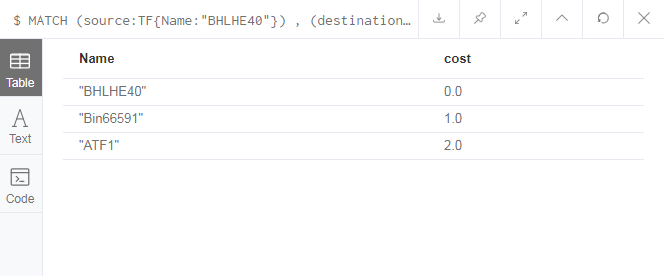
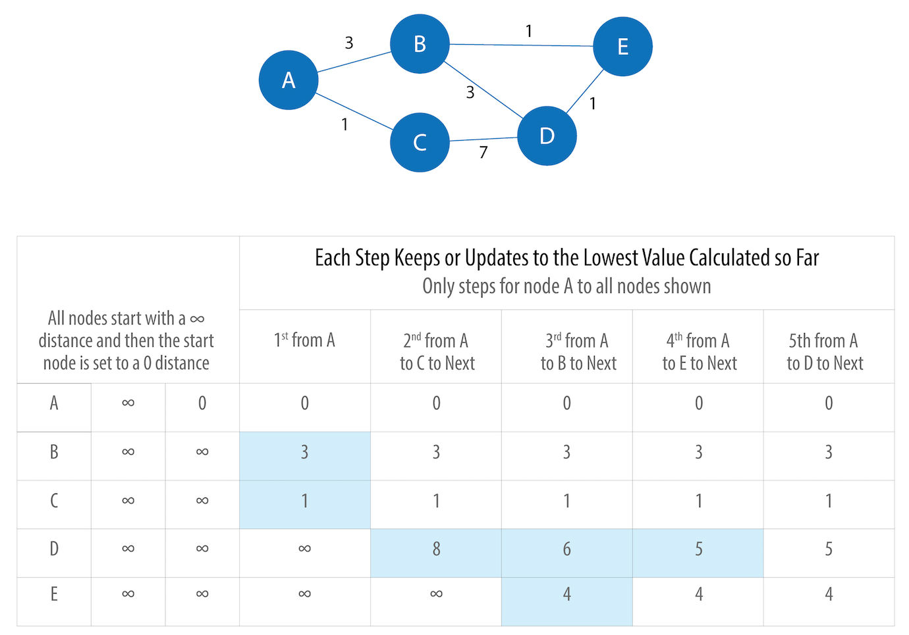
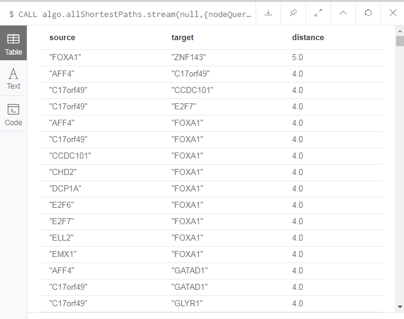
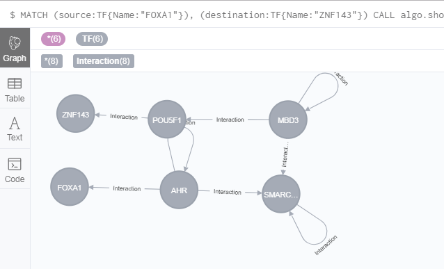

# Shortest paths


In this chapter, we only discuss shortest path and All pairs Shortest path. As you see, we show you overview of pathfinding and graph search algorithms.

Algorithm type	|What it does	|Example use
:-----------------|:----------|:----------
Shortest Path|	Calculates the shortest path between a pair of nodes	|Finding driving directions between two locations
All Pairs Shortest Path	|Calculates the shortest path between all pairs of nodes in the graph	|Evaluating alternate routesaround a traffic jam

## Shortest path
GREG supposted us find out the shortest relationship between two genes/nodes.

The Shortest Path algorithm calculates the shortest (weighted) path between a pair of nodes. 

The Shortest Path algorithm operates by first finding the lowest-weight relationship from the start node to directly connected nodes. It keeps track of those weights and moves to the closest node. It then performs the same calculation, but now as a cumulative total from the start node. The algorithm continues to do this, evaluating a wave of cumulative weights and always choosing the lowest weighted cumulative path to advance along, until it reaches the destination node.

Distance is often used within an algorithm as the name of the relationship property that indicates the cost of traversing between a pair of nodes. It s not required that this be an actual physical measure of distance. Hop is commonly used to express the number of relationships between two nodes.

In our example, we set the relationship property as null, because the database didn't have relationship property we can explore. Then, we only to find shortest paths based on hop (the number of nodes).

### algo.shortestPaths.stream
`algo.shortestPaths.stream` function calculates the shortest path between a pair of nodes.  `algo.shortestPaths.stream` form likes as following:
```
CALL algo.shortestPath.stream(startNode:Node, 
                    endNode:Node, 
                    weightProperty:String,
                    {nodeQuery:'labelName', 
                    relationshipQuery:'relationshipName', 
                    defaultValue:1.0, 
                    direction:'OUTGOING'})
 YIELD nodeId, cost
 ```

#### Parameters

Name	|Type	|Default	|Optional	|Description
:-----------|:--------|:----------------|:-----------------|:----------------
startNode|node|null|no|The start node
endNode|node|null|no|The end node
weightProperty|string|null|yes|The property name that contains weight. If null, treats the graph as unweighted. Must be numeric.
nodeQuery|string|null|yes|The label to load from the graph. If null, load all nodes
relationshipQuery|string|null|yes|The relationship-type to load from the graph. If null, load all nodes
defaultValue|float|null|yes|The default value of the weight in case it is missing or invalid
direction|string|outgoing|yes|The relationship direction to load from the graph. If 'both', treats the relationships as undirected

Name	|Type	|Description
:-------|:----------|:------------
nodeId|int|Node ID
cost|int|The cost it takes to get from start node to specific node

### Example
Example is find out shortest relationships of "BHLHE40" and "ATF1" TF genes:

```
MATCH (source:TF{Name:"BHLHE40"}) ,
	(destination:TF{Name:"ATF1"})
CALL algo.shortestPath.stream(source,destination,null)
YIELD nodeId, cost
RETURN algo.getNodeById(nodeId).Name AS Name, cost
```

The results are as follows:




## All Pairs Shortest Paths
The All Pairs Shortest Path (APSP) algorithm calculates the shortest (weighted) path between all pairs of nodes. It s more efficient than running the Single Source Shortest Path algorithm for every pair of nodes in the graph.

The calculation for APSP is easiest to understand when you follow a sequence of operations. The diagram in Figure 2-2 walks through the steps for node A.



-- This picture is from [*Graph Algorithms*](https://neo4j.com/lp/book-graph-algorithms-thanks/?aliId=eyJpIjoiT1lBd0tIeEh6Y2N6ajZCYiIsInQiOiJPemxyM1BhUG9uczhBdzFYRUwrM3Z3PT0ifQ%253D%253D).

Initially the algorithm assumes an infinite distance to all nodes. When a start node is selected, then the distance to that node is set to 0. The calculation then proceeds as follows：


1. From start node A we evaluate the cost of moving to the nodes we can reach and update those values. Looking for the smallest value, we have a choice of B (cost of 3) or C (cost of 1). C is selected for the next phase of traversal.

2. Now from node C, the algorithm updates the cumulative distances from A to nodes that can be reached directly from C. Values are only updated when a lower cost has been found
`A=0, B=3, C=1, D=8, E=∞`

3. Then B is selected as the next closest node that hasn t already been visited. It has relationships to nodes A, D, and E. The algorithm works out the distance to those nodes by summing the distance from A to B with the distance from B to each of those nodes. Note that the lowest cost from the start node A to the current node is always preserved as a sunk cost. The distance (d) calculation results

    `d(A,A) = d(A,B) + d(B,A) = 3 + 3 = 6`

    `d(A,D) = d(A,B) + d(B,D) = 3 + 3 = 6`

    `d(A,E) = d(A,B) + d(B,E) = 3 + 1 = 4`

   In this step the distance from node A to B and back to A, shown as d(A,A) = 6, is greater than the shortest distance already computed (0), so its value is not updated.
    
   The distances for nodes D (6) and E (4) are less than the previously calculated distances, so their values are updated.
    
4. E is selected next. Only the cumulative total for reaching D (5) is now lower, and therefore it is the only one updated.

5. When D is finally evaluated, there are no new minimum path weights; nothing is updated, and the algorithm terminates.

**NOTEs:**

Some pairs of nodes might not be reachable from each other, which means that there is no shortest path between these nodes. The algorithm doesn’t return distances for these pairs of nodes.

Even though the All Pairs Shortest Path algorithm is optimized to run calculations in parallel for each node, this can still add up for a very large graph. Consider using a subgraph if you only need to evaluate paths between a subcategory of nodes.

### algo.allShortestPaths.stream
```
CALL algo.allShortestPaths.stream( weightProperty: String,
                       {nodeQuery:'labelName', 	
                       relationshipQuery:'relationshipName',
                       defaultValue:1.0, 
                       concurrency:4}) 
YIELD sourceNodeId, targetNodeId, distance
```
 - The first parameter to this procedure is the property to use to work out the shortest weighted path. 
 
 - yields a stream of {sourceNodeId, targetNodeId, distance}
 
#### Parameters

 Name	|Type	|Default	|Optional	|Description
:-----------|:--------|:----------------|:-----------------|:----------------
weightProperty|string|null|yes|The property name that contains weight. If null, treats the graph as unweighted. Must be numeric.
nodeQuery|string|null|yes|The label to load from the graph. If null, load all nodes
relationshipQuery|string|null|yes|The relationship-type to load from the graph. If null, load all nodes
defaultValue|float|null|yes|The default value of the weight in case it is missing or invalid
direction|string|outgoing|yes|The relationship direction to load from the graph. If 'both', treats the relationships as undirected

Name	|Type	|Description
:-------|:----------|:------------
sourceNodeId|long|The start node ID
endNode|long|The end node ID
distance|int|The distance it takes to get from start node to specific node

### Example
Now, we want to find out all pairs TF genes shortest path in TF subgraph in GREG-minimum.

If we set this to null then the algorithm will calculate the unweighted shortest paths between all pairs of nodes in TF subgraph in GREG-minimum.

The following query does this:
```
CALL algo.allShortestPaths.stream(null,{nodeQuery:'TF'})
YIELD sourceNodeId, targetNodeId, distance
WHERE sourceNodeId < targetNodeId
RETURN algo.getNodeById(sourceNodeId).Name AS source,
algo.getNodeById(targetNodeId).Name AS target,
distance
ORDER BY distance DESC
```
The results are as follows:



## Exercise
#### 1. Find shortest path between "FOXA1" and "ZNF143" TFs, the result should be as graph.
```
MATCH (source:TF{Name:"FOXA1"}),
	(destination:TF{Name:"ZNF143"})
CALL algo.shortestPath.stream(source,destination,null)
YIELD nodeId, cost
RETURN algo.getNodeById(nodeId)
```
After add `{nodeQuery:'TF'}`, the result will be different. Because it limit all the nodes should be in TF nodes.
```
MATCH (source:TF{Name:"FOXA1"}),
	(destination:TF{Name:"ZNF143"})
CALL algo.shortestPath.stream(source,destination,null,{nodeQuery:'TF'})
YIELD nodeId, cost
RETURN algo.getNodeById(nodeId)
```
The results are as follows:



## Reference
1. The Neo4j Graph Algorithms User Guide v3.5   &nbsp;&nbsp;&nbsp;   &nbsp; [html](https://neo4j.com/docs/graph-algorithms/current/)    [PDF](https://neo4j.com/docs/pdf/neo4j-graph-algorithms-3.5.pdf)

2. Graph Algorithms    [PDF](https://neo4j.com/lp/book-graph-algorithms-thanks/?aliId=eyJpIjoiT1lBd0tIeEh6Y2N6ajZCYiIsInQiOiJPemxyM1BhUG9uczhBdzFYRUwrM3Z3PT0ifQ%253D%253D)
