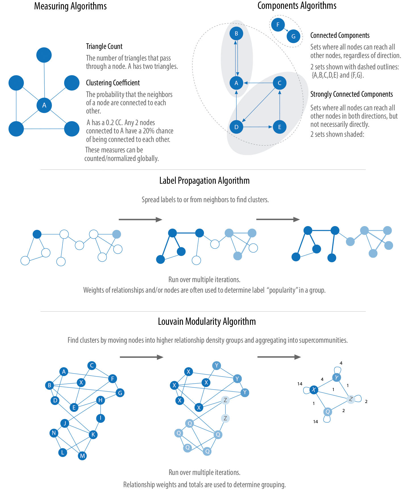
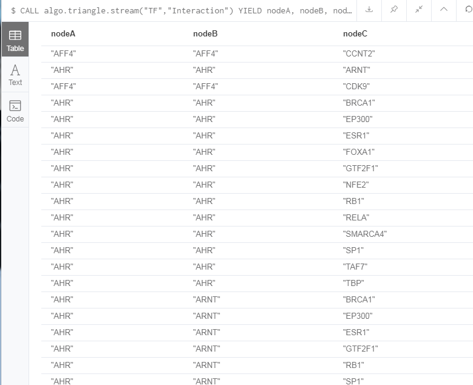
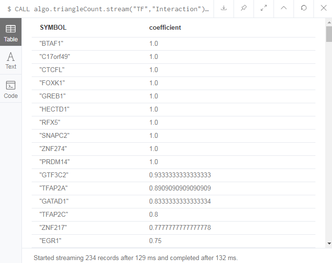
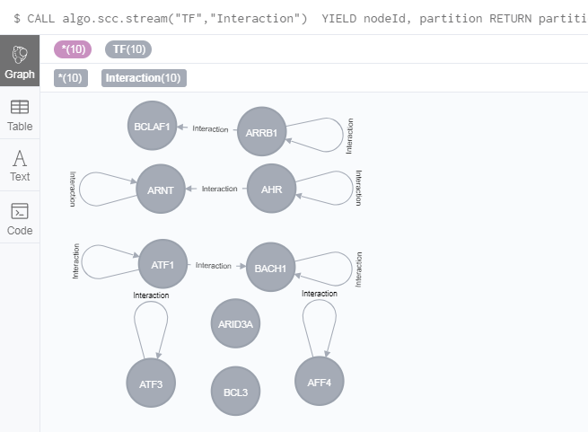
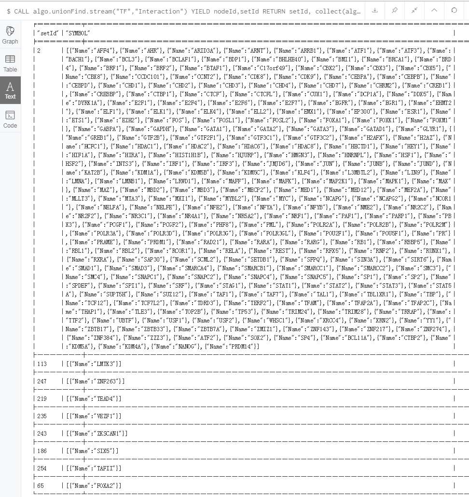
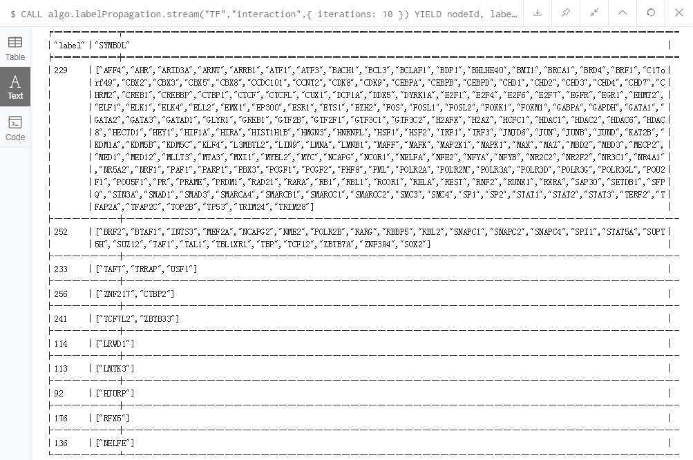
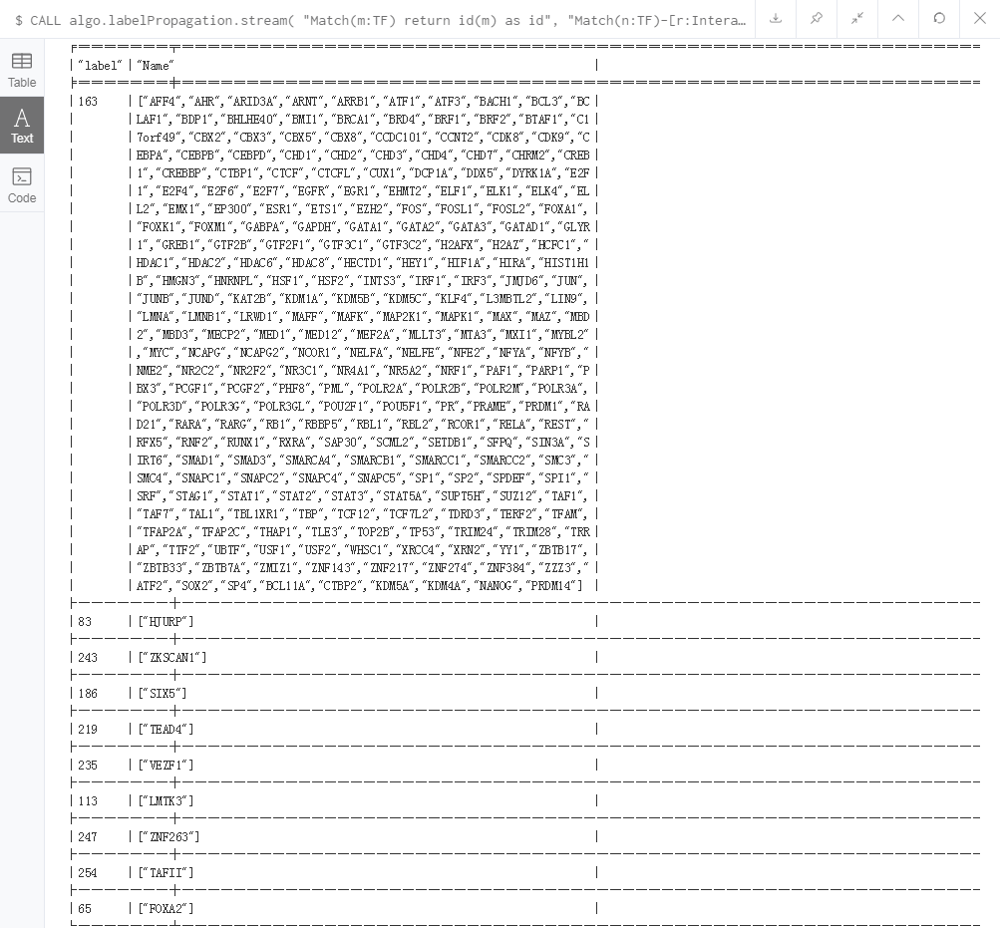
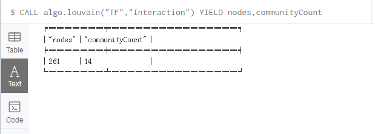

# Clustering and community detection

Algorithm type	|What it does 	|Example use
:-----------|:-----------|:-----------------
Triangle Count and Clustering Coefficient	|Measures how many nodes form traingles and the degree to which nodes tend to cluster together	|Estimating group stability and whether the network myght exhibit “small-world” behaviors seen in graphs with tightly knit clusters
Strongly Connected Components	|Finds groups where each node is reachable from every other node in that same group following the direction of relationships 	|Making product recommendations based on group affiliation or similar items
Connected Components	|Finds groups where each node is reachable from every other node in that same group, regardless of the direction of relationships	|Performing fast grouping for other algorithms and identify islands
Labek Progation	|Infers clusters by spreading labels based on neighborhood majorities	|Understanding consensus in social communities or finding dangerous combinations of possible co-prescribed drugs
Lovain Modularity	|Maximizes the presumed accuracy of groupings by comparing relationship weights and densities to a defined estimate or average	|In fraud analysis, evaluating whether a group has just a few discreete bad behaviors or is acting as a fraud ring

What its different about clustering and community detection show you on this picture.


-- This picture is from [*Graph Algorithms*](https://neo4j.com/lp/book-graph-algorithms-thanks/?aliId=eyJpIjoiT1lBd0tIeEh6Y2N6ajZCYiIsInQiOiJPemxyM1BhUG9uczhBdzFYRUwrM3Z3PT0ifQ%253D%253D).

## Triangles
Triangle Count determines the number of triangles passing through each node in the graph. A triangle is a set of three nodes, where each node has a relationship to all other nodes. Triangle Count can also be run globally for evaluating our overall dataset.

Networks with a high number of triangles are more likely to exhibit small-world structures and behaviors.

The goal of the Clustering Coefficient algorithm is to measure how tightly a group is clustered compared to how tightly it could be clustered. The algorithm uses Triangle Count in its calculations, which provides a ratio of existing triangles to possible relationships. A maximum value of 1 indicates a clique where every node is connected to every other node.

### algo.triangle.stream
We are use `algo.triangle.stream` to perform triangle count, which has the following format:
```
CALL algo.triangle.stream(label, 
                relationship, 
                {concurrency:4}) 
YIELD nodeA, nodeB, nodeC 
```
#### Paramenters
Parameters are described as follows:
Name	|Type	|Default	|Optional	|Description
:----|:------|:-----|:------|:------
label|string|null|yes|The label to load from the graph. If null, load all nodes
relationship|string|null|yes|The relationship-type to load from the graph. If null, load all nodes
concurrency|int|available CPUs|yes|The number of concurrent threads

Name	|Type	|Description
:-----|:------|:--------
nodeA|int|The ID of node in the given triangle
nodeB|int|The ID of node in the given triangle
nodeC|int|The ID of node in the given triangle

### Example
Getting a stream of the triangles of TFs:
```
CALL algo.triangle.stream("TF","Interaction")
YIELD nodeA, nodeB, nodeC
RETURN algo.getNodeById(nodeA).Name AS nodeA,
	algo.getNodeById(nodeB).Name AS nodeB,
	algo.getNodeById(nodeC).Name AS nodeC
```
The results are as follows:



Some TF nodes has interaction relationship with itself, so you will find out there have two nodes in the same line.

## Local Clustering Coefficient
Clustering Coefficient can provide the probability that randomly chosen nodes will be connected. You can also use it to quickly evaluate the cohesiveness of a specific group or your overall network. Together these algorithms are used to estimate resiliency and look for network structures.

### algo.triangleCount.stream

We are use `algo.triangleCount.stream` to perform local clustering coefficient, which has the following format:
```
CALL algo.triangleCount.stream(label, 
                    relationship, 
                    {concurrency:8}) 
YIELD nodeId, triangles
```
#### Paramenters
Parameters are described as follows:

Name	|Type	|Default	|Optional	|Description
:----|:------|:-----|:------|:------
label|string|null|yes|The label to load from the graph. If null, load all nodes
relationship|string|null|yes|The relationship-type to load from the graph. If null, load all nodes
concurrency|int|available CPUs|yes|The number of concurrent threads

Name	|Type	|Description
:-----|:------|:--------
nodeId|int|The ID of node
triangles|int|The number of triangles a node is member of

### Example

We can also work out the local clustering coefficient. The following query will calculate this for each TF gene:

```
CALL algo.triangleCount.stream("TF","Interaction")
YIELD nodeId, triangles, coefficient
WHERE coefficient > 0
RETURN algo.getNodeById(nodeId).Name AS SYMBOL, coefficient
ORDER BY coefficient DESC
```

The results are as follows:



## Strongly Connected Components
Use Strongly Connected Components as an early step in graph analysis to see how a graph is structured or to identify tight clusters that may warrant independent investigation. A component that is strongly connected can be used to profile similar behavior or inclinations in a group for applications such as recommendation engines.

### algo.scc.stream

We use `algo.scc.stream` to perform Strongly Conndected Components, which has the following format:
```
CALL algo.scc.stream(label:String, 
               relationship:String,
               {concurrency:4})
YIELD nodeId, partition
```
#### Paramenters
Parameters are described as follows:

Name	|Type	|Default	|Optional	|Description
:----|:----|:----|:-----|:----
label|string|null|yes|The label to load from the graph. If null, load all nodes
relationship|string|null|yes|The relationship-type to load from the graph. If null, load all relationships
concurrency|int|available CPUs|yes|The number of concurrent threads

Name	|Type	|Description
:-----|:------|:--------
nodeId|int|The ID of node
partition|int|Partition ID

### Example
To get strongly connected components in TF interaction subgraph in GREG-minimum.

```
//The result will be large
CALL algo.scc.stream("TF","Interaction") 
YIELD nodeId, partition
RETURN partition, collect(algo.getNodeById(nodeId)) AS SYMBOL
ORDER BY size(SYMBOL) DESC Limit 10
```
The results are as follows:



## Connected Components

The Connected Components algorithm (sometimes called Union Find or Weakly Connected Components) finds sets of connected nodes in an undirected graph where each node is reachable from any other node in the same set. It differs from the SCC algorithm because it only needs a path to exist between pairs of nodes in one direction, whereas SCC needs a path to exist in both directions. 

### algo.unionFind.stream
We use `algo.unionFind.stream` to perform Connected Components, which has the following format:
```
CALL algo.unionFind.stream(label:String, 
                  relationship:String,
                  {weightProperty:'weight', 
                  threshold:0.42, 
                  defaultValue:1.0, 
                  concurrency:4})
YIELD nodeId, setId
```
#### Paramenters
Name	|Type	|Default	|Optional	|Description
:----|:----|:----|:-----|:----
label|string|null|yes|The label to load from the graph. If null, load all nodes
relationship|string|null|yes|The relationship-type to load from the graph. If null, load all relationships
weightProperty|string|null|yes|The property name that contains weight. If null, treats the graph as unweighted. Must be numeric.
threshold|float|null|yes|The value of the weight above which the relationship is not thrown away
defaultValue|float|null|yes|The default value of the weight in case it is missing or invalid
concurrency|int|available CPUs|yes|The number of concurrent threads

Name	|Type	|Description
:-----|:------|:--------
nodeId|int|The ID of node
setId|int|Partition ID

### Example
To get connected components in TF interaction subgraph in GREG-minimum.
```
//The result will be large
CALL algo.unionFind.stream("TF","Interaction")
YIELD nodeId,setId
RETURN setId, collect(algo.getNodeById(nodeId)) AS SYMBOL
ORDER BY size(SYMBOL) DESC LIMIT 10
```
The results are as follows:



## Label Propagation

The Label Propagation algorithm (LPA) is a fast algorithm for finding communities in a graph. In LPA, nodes select their group based on their direct neighbors. This process is well suited to networks where groupings are less clear and weights can be used to help a node determine which community to place itself within. It also lends itself well to semisupervised learning because you can seed the process with preassigned, indicative node labels.

### algo.labelPropagation.stream
We use `algo.labelPropagation.stream` to perform Label Propagation, which has the following format:
```
CALL algo.labelPropagation.stream(label:String, 
                        relationship:String, 
                        config:Map<String, Object>) 
YIELD nodeId, label
```
### Example
To perform Label Propagation for clusting in TF interaction subgraph in GREG-minimum.
```
CALL algo.labelPropagation.stream("TF","interaction",{ iterations: 10 })
YIELD nodeId, label
RETURN label,
collect(algo.getNodeById(nodeId).Name) AS SYMBOL
ORDER BY size(SYMBOL) DESC LIMIT 10
```
The results are as follows:



**Set `graph:'cypher'` in the config, and run the code.** More about Cypher projection, you can see on [this web](https://neo4j.com/docs/graph-algorithms/current/projected-graph-model/cypher-projection/).

```
CALL algo.labelPropagation.stream(
    "Match(m:TF) return id(m) as id",
    "Match(n:TF)-[r:Interaction]-(m) return id(n) AS source, id(m) AS target",
    { iterations:10,graph:"cypher" })
YIELD nodeId, label
RETURN label,
collect(algo.getNodeById(nodeId).Name) AS Name
ORDER BY size(Name) DESC LIMIT 10
```
The results are as follows:



**Notes:**  

  The first query `Match(m:TF) return id(m) as id` returns TF node ids. The Cypher loader expects the query to return an id field.

  The second query `Match(n:TF)-[r:Interaction]-(m) return id(n) AS source, id(m) AS target` returns pairs of node ids that have a `Interaction` relationship between them in our projected graph. The Cypher loader expects the query to return source and target fields.

**Note that in both queries we use the id function to return the node id.**

   If the label and relationship-type projection is not selective enough to describe our subgraph to run the algorithm on, we can use Cypher statements to project subsets of our graph. Use a node-statement instead of the label parameter and a relationship-statement instead of the relationship-type, and use graph:'cypher' in the config.

   Relationships described in the relationship-statement will only be projected if both source and target nodes are described in the node-statement, otherwise they will be ignored.

   Cypher projection enables us to be more expressive in describing our subgraph that we want to analyse, but might take longer to project the graph with more complex cypher queries.
	
## Louvain

The Louvain Modularity algorithm finds clusters by comparing community density as it assigns nodes to different groups. You can think of this as a what if analysis to try various groupings with the goal of reaching a global optimum.

### algo.louvain

We use `algo.louvain` to perform Louvain, which has the following format:
```
CALL algo.louvain(label:String, 
            relationship:String,
            {weightProperty:'weight', 
            defaultValue:1.0,
            write: true, 
            writeProperty:'community', 
            concurrency:4, 
            communityProperty:'propertyOfPredefinedCommunity',
            innerIterations:10, 
            communitySelection:'classic'}) 
YIELD nodes, communityCount, iterations, loadMillis, computeMillis, writeMillis
```

#### Paramenters
Parameters are described as follows:

Name	|Type	|Default	|Optional	|Description
:----|:----|:----|:-----|:----
label|string|null|yes|The label to load from the graph. If null, load all nodes
relationship|string|null|yes|The relationship-type to load from the graph. If null, load all relationships
weightProperty|string|null|yes|The property name that contains weight. If null, treats the graph as unweighted. Must be numeric.
write|boolean|true|yes|Specifies if the result should be written back as a node property
writeProperty|string|'community'|yes|The property name written back to the ID of the community that particular node belongs to
communityProperty|string|null|yes|The property name that contains an initial or pre-defined community (must be a number)
defaultValue|float|null|yes|The default value of the weight in case it is missing or invalid
concurrency|int|available CPUs|yes|The number of concurrent threads

Name	|Type	|Description
:-----|:------|:--------
nodes|int|The number of nodes considered
communityCount|int|The number of communities found

### Example
Calculate the number of clustering in TF interaction subgraph in GREG-minimum by Louvain.
```
CALL algo.louvain("TF","Interaction")
YIELD nodes,communityCount
```
The results are as follows:



## Reference
1. The Neo4j Graph Algorithms User Guide v3.5   &nbsp;&nbsp;&nbsp;   &nbsp; [html](https://neo4j.com/docs/graph-algorithms/current/)    [PDF](https://neo4j.com/docs/pdf/neo4j-graph-algorithms-3.5.pdf)

2. Graph Algorithms    [PDF](https://neo4j.com/lp/book-graph-algorithms-thanks/?aliId=eyJpIjoiT1lBd0tIeEh6Y2N6ajZCYiIsInQiOiJPemxyM1BhUG9uczhBdzFYRUwrM3Z3PT0ifQ%253D%253D)
