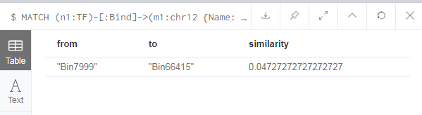

# Network alignment

## Jaccard Similarity 
The Jaccard index is a statistic used for comparing the similarity between pairs of sample sets or nodes in our example. It is defined as the size of the intersection divided by the size of the union of the sample sets.

### algo.similarity.jaccard
The Jaccard similarity function computes the similarity of two lists of numbers, which has the following format.

```
CALL algo.similarity.jaccard(userData:List<Map>, {
                    topK: 1, 
                    similarityCutoff: 0.1, 
                    write:true, 
                    writeProperty: "jaccardSimilarity"})
YIELD nodes, similarityPairs, write, writeRelationshipType, writeProperty, min, max, mean, stdDev, p25, p50, p75, p90, p95, p99, p999, p100
```
#### Paramenters
Parameters are described as follows:

Name	|Type	|Default	|Optional	|Description
:--------|:-----|:------------|:--------|:---------
data|list|null|no|A list of maps of the following structure: {item: nodeId, categories: [nodeId, nodeId, nodeId]}
top|int|0|yes|The number of similar pairs to return. If 0, it will return as many as it finds.
topK|int|0|yes|The number of similar values to return per node. If 0, it will return as many as it finds.
similarityCutoff|int|-1|yes|The threshold for Jaccard similarity. Values below this will not be returned.
write|boolean|false|yes|Indicates whether results should be stored.
writeProperty|string|score|yes|The property to use when storing results.

Name	|Type	|Description
:--------|:-------|:---------
nodes|int|The number of nodes passed in.
similarityPairs|int|The number of pairs of similar nodes computed.
write|boolean|Indicates whether results were stored.
writeRelationshipType|string|The relationship type used when storing results.
writeProperty|string|The property used when storing results.
min|double|The minimum similarity score computed.
max|double|The maximum similarity score computed.
mean|double|The mean of similarities scores computed.
stdDev|double|The standard deviation of similarities scores computed.
p25|double|The 25 percentile of similarities scores computed.
p50|double|The 50 percentile of similarities scores computed.
p75|double|The 75 percentile of similarities scores computed.
p90|double|The 90 percentile of similarities scores computed.
p95|double|The 95 percentile of similarities scores computed.
p99|double|The 99 percentile of similarities scores computed.
p999|double|The 99.9 percentile of similarities scores computed.
p100|double|The 25 percentile of similarities scores computed.

### Example
To compare Two network That TFs bind to Bin7999 and Bin66415 in chr12.  
```
//To get network which relationship is TF Bind to Chr1 Bin7999
MATCH (n1:TF)-[:Bind]->(m1:chr12 {Name: 'Bin7999'})
WITH m1, collect(id(n1)) AS mn1

//To get network which relationship is TF Bind to Chr12 Bin66415
MATCH (n2:TF)-[:Bind]->(m2:chr12{Name:"Bin66415"}) WHERE m1 <> m2
WITH m1, mn1, m2, collect(id(n2)) AS mn2

//Return jasscard score of two network 
RETURN m1.Name AS from,
       m2.Name AS to,
       algo.similarity.jaccard(mn1, mn2) AS similarity
ORDER BY similarity DESC
```
The results are as follows:



### algo.similarity.jaccard.stream
The Jaccard Similarity procedure computes similarity between all pairs of items. It is a symmetrical algorithm, which means that the result from computing the similarity of Item A to Item B is the same as computing the similarity of Item B to Item A. We can therefore compute the score for each pair of nodes once. We don’t compute the similarity of items to themselves. This function has the following format.

```
CALL algo.similarity.jaccard.stream(userData:List<Map>, {
                        degreeCutoff: 10, 
                        similarityCutoff: 0.1, 
                        concurrency:4
})
YIELD item1, item2, count1, count2, intersection, similarity
```
#### Paramenters
Parameters are described as follows:

Name	| Type	|Default	|Optional|	Description
:--------|:--------|:-----------|:---------|:-------------
data|list|null|no|A list of maps of the following structure: {item: nodeId, categories: [nodeId, nodeId, nodeId]}
top|int|0|yes|The number of similar pairs to return. If 0, it will return as many as it finds.
topK|int|0|yes|The number of similar values to return per node. If 0, it will return as many as it finds.
similarityCutoff|int|-1|yes|The threshold for Jaccard similarity. Values below this will not be returned.
degreeCutoff|int|0|yes|The threshold for the number of items in the targets list. If the list contains less than this amount, that node will be excluded from the calculation.
concurrency|int|available CPUs|yes|The number of concurrent threads.
sourceIds|long[]|null|yes|The ids of items from which we need to compute similarities. Defaults to all the items provided in the data parameter.
targetIds|long[]|null|yes|The ids of items to which we need to compute similarities. Defaults to all the items provided in the data parameter.
sourceIds|long[]|null|yes|The ids of items from which we need to compute similarities. Defaults to all the items provided in the data parameter.
targetIds|long[]|null|yes|The ids of items to which we need to compute similarities. Defaults to all the items provided in the data parameter.

Name	|Type	|Description
:-----|:--------------------|:--------------
item1|int|The ID of one node in the similarity pair.
item2|int|The ID of other node in the similarity pair.
count1|int|The size of the targets list of one node.
count2|int|The size of the targets list of other node.
intersection|int|The number of intersecting values in the two nodes targets lists.
similarity|int|The Jaccard similarity of the two nodes.

### Example
The following will return a stream of TFs pairs along with their intersection and Jaccard similarities:

```
MATCH (p:TF)-[:Interaction]->(n:TF)
WITH {item:id(p), categories: collect(id(n))} as userData
WITH collect(userData) as data

CALL algo.similarity.jaccard.stream(data)
YIELD item1, item2, count1, count2, intersection, similarity
RETURN algo.asNode(item1).Name AS from, algo.asNode(item2).Name AS to, intersection, similarity
ORDER BY similarity DESC
```
The results are as follows:


### Example--Specifying source and target ids
Sometimes, we don't want to compute all pairs similarity, but would rather specify subsets of items to compare to each other. 

We do this using the `sourceIds` and `targetIds` keys in the config. 

We might want to use this technique when comparing nodes with different labels that intersect on a common label.

**The following will find similarities between subgraphs based on direct relationship of "CBX5" and "BACH1":**

```
MATCH (p:TF)-[:Interaction]->(n)
WITH {item:id(p), name: p.name, categories: collect(id(n))} as data
WITH collect(data) AS pns

// create sourceIds list containing ids for CBX5 and BACH1
WITH pns,
     [value in pns WHERE value.name IN ["CBX5", "BACH1"] | value.item ] AS sourceIds

CALL algo.similarity.jaccard.stream(pns, {sourceIds: sourceIds, topK: 1})
YIELD item1, item2, similarity
WITH algo.getNodeById(item1) AS from, algo.getNodeById(item2) AS to, similarity
RETURN from.Name AS from, to.Name AS to, similarity
ORDER BY similarity DESC
```
The results are as follows:


## Exercise

try to get jaccard similarity between TF based on compare TF bind Chr12 between MCF7 and K562 cell.
```
// compute categories for TF with bind relationship in MCF7 cell
MATCH (n1:TF)-[r1:Bind]->(n2:chr12)
where r1.CellType="MCF7"
WITH {item:id(n1), categories: collect(id(n2))} as data
WITH collect(data) AS MCF7

// compute categories for TF with bind relationship in K562 cell
MATCH (m1:TF)-[r2:Bind]->(m2:chr12)
where r2.CellType="K562"
WITH MCF7,{item:id(m1), categories: collect(id(m2))} as data2
WITH MCF7, collect(data2) AS K562

// create sourceIds and targetIds lists
WITH MCF7, K562,
     [value in MCF7 | value.item] AS sourceIds,
     [value in K562 | value.item] AS targetIds

//perform jaccard function
CALL algo.similarity.jaccard.stream(MCF7 + K562, {sourceIds: sourceIds, targetIds: targetIds})
YIELD item1, item2, similarity
WITH algo.getNodeById(item1) AS from, algo.getNodeById(item2) AS to, similarity


where similarity <= 0.5
RETURN from.Name AS from, to.Name AS to, similarity
ORDER BY similarity DESC
LIMIT 10
```
## Reference
1. The Neo4j Graph Algorithms User Guide v3.5   &nbsp;&nbsp;&nbsp;   &nbsp; [html](https://neo4j.com/docs/graph-algorithms/current/)    [PDF](https://neo4j.com/docs/pdf/neo4j-graph-algorithms-3.5.pdf)

2. Graph Algorithms    [PDF](https://neo4j.com/lp/book-graph-algorithms-thanks/?aliId=eyJpIjoiT1lBd0tIeEh6Y2N6ajZCYiIsInQiOiJPemxyM1BhUG9uczhBdzFYRUwrM3Z3PT0ifQ%253D%253D)
