# Centralities
Centrality algorithms are used to understand the roles of particular nodes in a graph and their impact on that network. They are useful because they identify the most important nodes and help us understand group dynamics such as credibility, accessibility, the speed at which things spread, and bridges between groups. 

**In biologically, centrality algorithms help us find out what are important genes, which one play an important position to control or regulate, and what is critical gene in the research project.**

Here we introduce closness centrality, pageRank and betweenness centrality. Now, let us to know what it does with those centrality algorithms.

Algorithm type	|What it does	|Example use
:---------|:------------|:-------
Degree Centrality	|Measures the number of relationships a node has|Estimating a person's popularity by looking at their in-degree and using their out-degree to estimate gregariousness
Closeness Centrality	|Calculates which nodes have the shortest paths to all other nodes	|Finding the optimal location of new public services for maximum accessibility
Betweenness Centrality	|Measures the number of shortest paths that through a node 	|Improving drug targeting by finding the control genes for sepcific diseases
PageRank	|Estimates a current node's importance from its linked neighbors( popularized by Google)	|Finding the most influential features for extraction in machine learning and rankinng text for entity relevance in natural language processing

The measure of a node s centrality is its average farness (inverse distance) to all other nodes. Nodes with a high closeness score have the shortest distances from all other nodes.
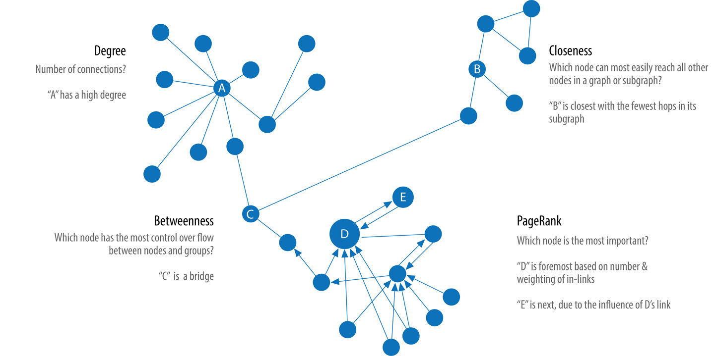
-- This picture is from [*Graph Algorithms*](https://neo4j.com/lp/book-graph-algorithms-thanks/?aliId=eyJpIjoiT1lBd0tIeEh6Y2N6ajZCYiIsInQiOiJPemxyM1BhUG9uczhBdzFYRUwrM3Z3PT0ifQ%253D%253D).

## Degree Centrality

### algo.degree.stream
We use `algo.degree.stream` to perform Degree Centrality, which has the following format:
```
CALL algo.degree.stream(label:String, 
                relationship:String,
                {concurrency:4})
YIELD node, score
```

#### Parameters
Parameters are described as follows:

Name	|Type	|Default	|Optional|	Description
:--------|:--------|:-----------|:---------|:--------------
label|string|null|yes|The label to load from the graph. If null, load all nodes.
relationship|string|null|yes|The relationship-type to load from the graph. If null, load all nodes.
direction|string|incoming|yes|The relationship direction to load from the graph. If 'both', treats the relationships as undirected.
concurrency|int|available CPUs|yes|The number of concurrent threads.

Name	|Type	|Description
:--------|:----------|:-----------
nodeId|long|Node ID
score|float|Degree Centrality score

### Example
```
CALL algo.degree.stream("TF", "Interaction", {direction: "incoming"})
YIELD nodeId, score
RETURN algo.asNode(nodeId).Name AS Name, score 
ORDER BY score DESC
```
The results are as follows:

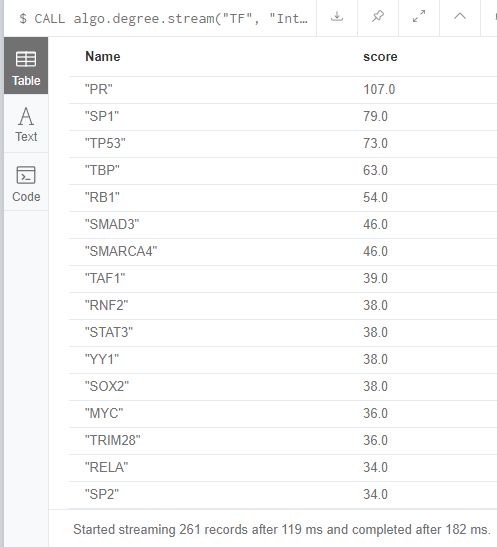

## Closeness Centrality
Closeness Centrality is a way of detecting nodes that are able to spread information efficiently through a subgraph.

Neo4j's implementation of Closeness Centrality uses the following formula:
    
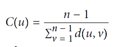  

where:  

   u is a node. 

   n is the number of nodes in the same component (subgraph or group) as u.

   d(u,v) is the shortest-path distance between another node v and u.
	
**In our graph, we can use this measure to get which gene are able to relate other genes efficiently.**

### algo.closeness.stream

We use `algo.closeness.stream` to perform Closeness Centrality, which has the following format:

```
CALL algo.closeness.stream(label:String, 
                  relationship:String, 
                  {concurrency:4})
YIELD nodeId, centrality
```
#### Paramenters
Parameters are described as follows:

Name| Type| Default | Optional | Description
:----|:----|:-----|:------|:-------
label | string |null|yes |The label to load from the graph. If null, load all nodes
relationship|string|null|yes|The relationship-type to load from the graph. If null, load all relationships
concurrency|int|available CPUs|yes|The number of concurrent threads
graph|string|'heavy' |yes |Use 'heavy' when describing the subset of the graph with label and relationship-type parameter,. Use 'cypher' for describing the subset with cypher node-statement and relationship-statement

Name	|Type	|Description
:----|:-----|:------
node|long|Node ID
centrality|float|Closeness centrality weight

### Example
To calculate the closeness centrality for each of TF nodes in our graph:
```
CALL algo.closeness.stream("TF", "Interaction")
YIELD nodeId, centrality
RETURN algo.getNodeById(nodeId).Name, centrality
ORDER BY centrality DESC
```
The results are as follows:

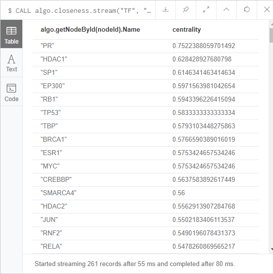


## Closeness Centrality Variation: Wasserman and Faust

Stanley Wasserman and Katherine Faust came up with an improved formula for calculating closeness for graphs with multiple subgraphs without connections between those groups. Details on their formula are in their book, Social Network Analysis: Methods and Applications. The result of this formula is a ratio of the fraction of nodes in the group that are reachable to the average distance from the reachable nodes. The formula is as follows

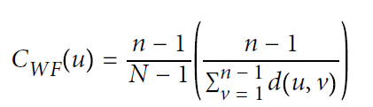

where:

   u is a node. 

   N is the total node count. 

   n is the number of nodes in the same component as u. 
   
   d(u,v) is the shortest-path distance between another node v and u.

**To calculating closeness for graphs with multiple subgraphs without connections between those groups by improve fomula.**

### algo.closeness.stream
We can tell the Closeness Centrality procedure to use this formula by passing the parameter `improved: true`.
```
CALL algo.closeness.stream(label:String, 
                  relationship:String，
                  {concurrency:4,
                  improved: true}) 
YIELD nodeId, centrality
```
#### Paramenters
Parameters are described as follows:

Name| Type| Default | Optional | Description
:----|:----|:-----|:------|:-------
label | string |null|yes |The label to load from the graph. If null, load all nodes
relationship|string|null|yes|The relationship-type to load from the graph. If null, load all relationships
concurrency|int|available CPUs|yes|The number of concurrent threads

Name	|Type	|Description
:----|:-----|:------
node|long|Node ID
centrality|float|Closeness centrality weight

### Example
To calculate the closeness centrality for each of TF nodes in our graph by Wasserman and Faust:
```
CALL algo.closeness.stream("TF", "Interaction",{improved: true})
YIELD nodeId, centrality
RETURN algo.getNodeById(nodeId).Name, centrality
ORDER BY centrality DESC
```
The results are as follows:


## Closeness Centrality Variation: Harmonic Centrality
Harmonic Centrality (also known as Valued Centrality) is a variant of Closeness Centrality, invented to solve the original problem with unconnected graphs. In Harmony in a Small World , M. Marchiori and V. Latora proposed this concept as a practical representation of an average shortest path.

When calculating the closeness score for each node, rather than summing the distances of a node to all other nodes, **it sums the inverse of those distances**. This means that infinite values become irrelevant.

The raw harmonic centrality for a node is calculated using the following formula

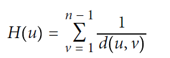  

where:

   u is a node.

   n is the number of nodes in the graph.

   d(u,v) is the shortest-path distance between another node v and u.
	 
### algo.closeness.harmonic.stream

We use `algo.closeness.harmonic.stream` to perform Harmonic Centrality, which has the following format:

```
CALL algo.closeness.harmonic.stream(label:String, 
                        relationship:String,
                        {concurrency:4}) 
YIELD nodeId, centrality
```
#### Paramenters
Parameters are described as follows:

Name| Type| Default | Optional | Description
:----|:----|:-----|:------|:-------
label | string |null|yes |The label to load from the graph. If null, load all nodes
relationship|string|null|yes|The relationship-type to load from the graph. If null, load all relationships
concurrency|int|available CPUs|yes|The number of concurrent threads

Name	|Type	|Description
:----|:-----|:------
node|long|Node ID
centrality|float|Closeness centrality weight

### Example
To calculate the closeness centrality for each of TF nodes in our graph by Harmonic Centrality:
```
CALL algo.closeness.harmonic.stream("TF", "Interaction")
YIELD nodeId, centrality
RETURN algo.getNodeById(nodeId).Name, centrality
ORDER BY centrality DESC
```
The results are as follows:

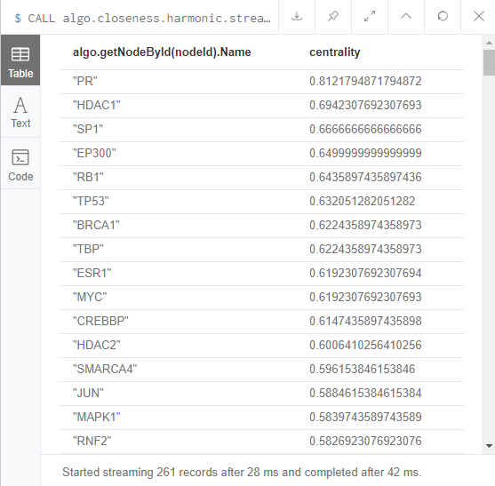


## Betweenness Centrality

Betweenness Centrality is a way of detecting the amount of influence a node has over the flow of information or resources in a graph. It is typically used **to find nodes that serve as a bridge from one part of a graph to another**.

The Betweenness Centrality algorithm first calculates the shortest (weighted) path between every pair of nodes in a connected graph. Each node receives a score, based on the number of these shortest paths that pass through the node. The more shortest paths that a node lies on, the higher its score.

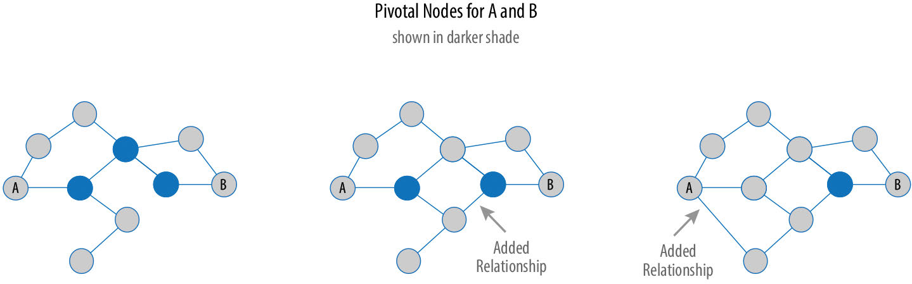
-- This picture is from [*Graph Algorithms*](https://neo4j.com/lp/book-graph-algorithms-thanks/?aliId=eyJpIjoiT1lBd0tIeEh6Y2N6ajZCYiIsInQiOiJPemxyM1BhUG9uczhBdzFYRUwrM3Z3PT0ifQ%253D%253D).


Pivotal nodes play an important role in connecting other nodes if you remove a pivotal node, the new shortest path for the original node pairs will be longer or more costly. This can be a consideration for evaluating single points of vulnerability.

The betweenness centrality of a node is calculated by adding the results of the following formula for all shortest paths:
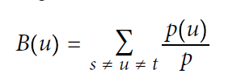

where:

   u is a node. 

   p is the total number of shortest paths between nodes s and t.

   p(u) is the number of shortest paths between nodes s and t that pass through node u.

The figure illustrates the steps for working out betweenness centrality.

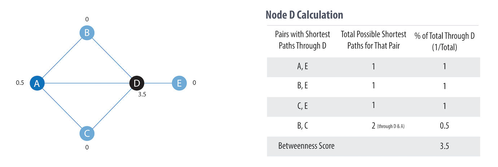

Here's the procedure: 

   1. For each node, find the shortest paths that go through it. a. B, C, E have no shortest paths and are assigned a value of 0. 

   2. For each shortest path in step 1, calculate its percentage of the total possible shortest paths for that pair. 

   3. Add together all the values in step 2 to find a node s betweenness centrality score. The table in Figure 5-8 illustrates steps 2 and 3 for node D. 

   4. Repeat the process for each node.
	
### algo.betweenness.stream
We use `algo.betweenness.stream` to perform betweenness Centrality, which has the following format:
```
CALL algo.betweenness.stream(label:String, 
                    relationship:String, 
                   {direction:'out', 
                    concurrency:4})
YIELD nodeId, centrality
```
#### Paramenters
Parameters are described as follows:

Name| Type| Default | Optional | Description
:----|:----|:-----|:------|:-------
label | string |null|yes |The label to load from the graph. If null, load all nodes
relationship|string|null|yes|The relationship-type to load from the graph. If null, load all relationships
concurrency|int|available CPUs|yes|The number of concurrent threads
direction|string|outgoing|yes|The relationship direction to load from the graph. If 'both', treats the relationships as undirected

Name	|Type	|Description
:----|:-----|:------
node|long|Node ID
centrality|float|Closeness centrality weight

### Example
To measure the number of shotest paths that pass through a TF gene in this database.
```
CALL algo.betweenness.stream("TF", "Interaction")
YIELD nodeId, centrality
RETURN algo.getNodeById(nodeId).Name, centrality
ORDER BY centrality DESC
```

The results are as follows:


## Betweenness Centrality Variation: Randomized-Approximate Brandes

The Randomized-Approximate Brandes (RA-Brandes for short) algorithm is the best-known algorithm for calculating an approximate score for betweenness centrality. **Rather than calculating the shortest path between every pair of nodes, the RABrandes algorithm considers only a subset of nodes.** Two common strategies for selecting the subset of nodes are:
    
**Random** 

   Nodes are selected uniformly, at random, with a defined probability of selection. The default probability is: log10 N e2 . If the probability is 1, the algorithm works the same way as the normal Betweenness Centrality algorithm, where all nodes are loaded.
    
**Degree** 

   Nodes are selected randomly, but those whose degree is lower than the mean are automatically excluded (i.e., only nodes with a lot of relationships have a chance of being visited). 

   As a further optimization, you could limit the depth used by the Shortest Path algorithm, which will then provide a subset of all the shortest paths.

### algo.betweenness.sampled.stream
We use `algo.betweenness.sampled.stream` to perform Randomized-Approximate Brandes, which has the following format.
```
CALL algo.betweenness.sampled.stream(label:String, 
                         relationship:String, 
                         {strategy:{'random', 'degree'},
                         probability:double, 
                         maxDepth:int, 
                         direction:String, 
                         concurrency:int})
YIELD nodeId, centrality
```

#### Paramenters
Parameters are described as follows:

Name| Type| Default | Optional | Description
:----|:----|:-----|:------|:-------
label | string |null|yes |The label to load from the graph. If null, load all nodes
relationship|string|null|yes|The relationship-type to load from the graph. If null, load all relationships
strategy|string|'random'|yes|The node selection strategy
probability|float|log10(N) / e^2|yes|The probability a node is selected. Values between 0 and 1. If 1, selects all nodes and works like original Brandes algorithm
maxDepth|int|Integer.MAX|yes|The depth of the shortest paths traversal
concurrency|int|available CPUs|yes|The number of concurrent threads
direction|string|outgoing|yes|The relationship direction to load from the graph. If 'both', treats the relationships as undirected

Name	|Type	|Description
:----|:-----|:------
node|long|Node ID
centrality|float|Closeness centrality weight

### Example
The following query executes the RA-Brandes algorithm using the random selection method.
```
CALL algo.betweenness.sampled.stream("TF", "Interaction", {strategy:"degree"})
YIELD nodeId, centrality
RETURN algo.getNodeById(nodeId).Name AS user, centrality
ORDER BY centrality DESC
```
The results are as follows:

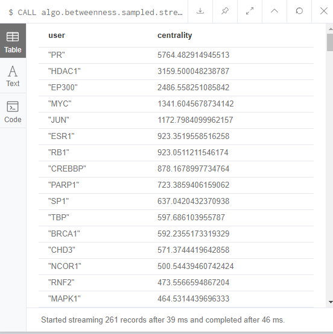

## PageRank
PageRank is the best known of the centrality algorithms. It measures the transitive (or directional) influence of nodes. All the other centrality algorithms we discuss measure the direct influence of a node, whereas **PageRank considers the influence of a node s neighbors, and their neighbors.**  For example, having a few very powerful friends can make you more influential than having a lot of less powerful friends. **PageRank is computed either by iteratively distributing one node s rank over its neighbors or by randomly traversing the graph and counting the frequency with which each node is hit during these walks.**

PageRank is defined in the original Google paper as follows：

 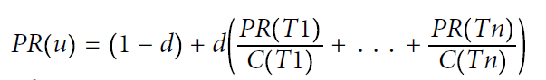
    
where: 

   We assume that a page u has citations from pages T1 to Tn. 

   d is a damping factor which is set between 0 and 1. It is usually set to 0.85. You can think of this as the probability that a user will continue clicking. This helps minimize rank sink, explained in the next section. 

   1-d is the probability that a node is reached directly without following any relationships. 

   C(Tn) is defined as the out-degree of a node T.  
	
### algo.pageRank.stream
We use `algo.pageRank.stream` to perform PageRank, which has the following format.

```
CALL algo.pageRank.stream(label:String, 
                relationship:String,
                {direction:'OUTGOING', 
                iterations:20, 
                dampingFactor:0.85, 
                concurrency:4})
YIELD node, score
```
#### Paramenters
Parameters are described as follows:

Name| Type| Default | Optional | Description
:----|:----|:-----|:------|:-------
label | string |null|yes |The label to load from the graph. If null, load all nodes
relationship|string|null|yes|The relationship-type to load from the graph. If null, load all relationships
direction|string|'OUTGOING'|yes|The relationship-direction to use in the algorithm
iterations|int|20|yes|How many iterations of PageRank to run
dampingFactor|float|0.85|yes|The damping factor of the PageRank calculation
concurrency|int|available CPUs|yes|The number of concurrent threads

Name	|Type	|Description
:---|:---|:-----
nodeId|long|Node ID
score|float|PageRank weight

### Example

A call to the following procedure will calculate the PageRank for each of the TF gene in our graph：

```
CALL algo.pageRank.stream("TF", "Interaction", {iterations:20,dampingFactor:0.85})
YIELD nodeId, score
RETURN algo.getNodeById(nodeId).Name, score
ORDER BY score DESC
```
The results are as follows:

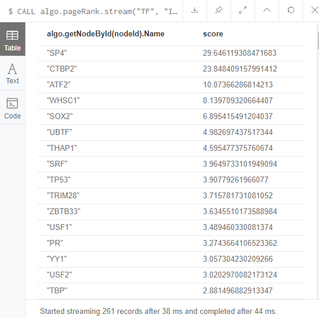

## Reference
1. The Neo4j Graph Algorithms User Guide v3.5   &nbsp;&nbsp;&nbsp;   &nbsp; [html](https://neo4j.com/docs/graph-algorithms/current/)    [PDF](https://neo4j.com/docs/pdf/neo4j-graph-algorithms-3.5.pdf)

2. Graph Algorithms    [PDF](https://neo4j.com/lp/book-graph-algorithms-thanks/?aliId=eyJpIjoiT1lBd0tIeEh6Y2N6ajZCYiIsInQiOiJPemxyM1BhUG9uczhBdzFYRUwrM3Z3PT0ifQ%253D%253D)

