# R and Neo4J
At this part, we want to talk neo4j with R. we wil discuss [`RNeo4j`](https://github.com/nicolewhite/RNeo4j),
[`neo4jshell`](https://github.com/keithmcnulty/neo4jshell) 
and [`neo4r`](https://github.com/neo4j-rstats/neo4r) 
three R packages. Three packages allow us to read and write dat from/to Neo4j directly from R environment.

## RNeo4j
The first packages, we are discussing RNeo4j which have many function to operate neo4j. We will show the main function
`cypher` and `cypherToList`.

### 1. Install RNoe4j
 There proves three ways to install RNeo4j.
**Install from CRAN**
 ```
 install.packages("RNeo4j")
 ```
**Install from Github**
 ```
 #install.packages("devtools")
devtools::install_github("nicolewhite/RNeo4j")
```
**Install from Source**  
Go to the [latest release](https://github.com/nicolewhite/RNeo4j/releases/tag/v1.6.1) and download the source code. You can then install with install.packages.
```
install.packages("/path/to/file.tar.gz", repos=NULL, type="source")
```

### 2. Connect neo4j
The first step of Three packages driving neo4j is the same things to edite the following line in `conf/neo4j-server.properties`.
```
# Require (or disable the requirement of) auth to access Neo4j
dbms.security.auth_enabled=false
```
It just find out and delete `#` in the front.

After that, **You need to start neo4j before you connect with neo4j with `RNeo4j`.** `Rneo4j` prove `startGraph` function to connect neo4j.  You should prove you username and password.
```
graph = startGraph("http://localhost:7474/db/data/", username="neo4j", password="password")
```
### 3. Cypher query with RNeo4j
`RNeo4j` prove `cypher` and `cypherToList` two main functions for cypher query. If you're returning tabular results, use `cypher`, which will give you a data.frame. For example to get all labels in GREG-minimum.
```
query = " MATCH (n) RETURN distinct labels(n)"
cypher(graph,query)
``` 
The results shows like as following:
  
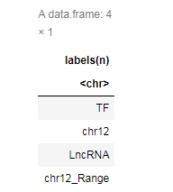

For anything more complicated, use `cypherToList`, which will give a list. For comparing the different of 
`cypher`, we use the same example.
```
query = " MATCH (n) RETURN distinct labels(n)"
cypherToList(graph,query)
```
The results shows like as following:
  
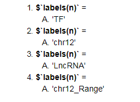

Actually, `RNeo4j` prove `getLabel` to get all labels of neo4j.
```
RNeo4j::getLabel(graph)
```

### 4. Convert graph in R
We use `graph.data.frame` function in `igraph` to make data.frame as igraph object. `graph_from_data_frame` creates 
an igraph graoh from one or two data fromes containing the (symbolic) edge list and edge/vertex attributes, which has 
the following format.
```
graph_from_data_frame(d, directed = TRUE, vertices = NULL)
```
#### Paramenters
Arguments|  description
:---------|:----------------
d   |    A data frame containing a symbolic edge list in the first two columns. Additional columns are considered as edge attributes.
directed  |  Logical scalar, whether or not to create a directed graph.
vertices	| A data frame with vertex metadata, or NULL. 


Here use relationship of TF binding chr12 as example.  

First, we get a data.frame by `cypher`.
```
query = "
MATCH p=(n:TF)-[r:Bind]->(m:chr12) RETURN n.Name, m.Name,r.CellType LIMIT 3"
G_RNeo4j <- RNeo4j::cypher(graph,query)
G_RNeo4j
```
`G_RNeo4j` shows like that:  

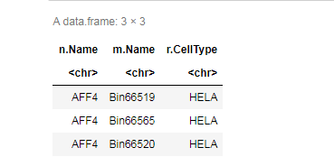

Second, use `graph.data.frame` function in `igraph` to create a igraph object.
```
#install.packages("igraph")
ig <- igraph::graph.data.frame((G_RNeo4j,directed = F)
plot(ig)
```
The picture shows like that:  
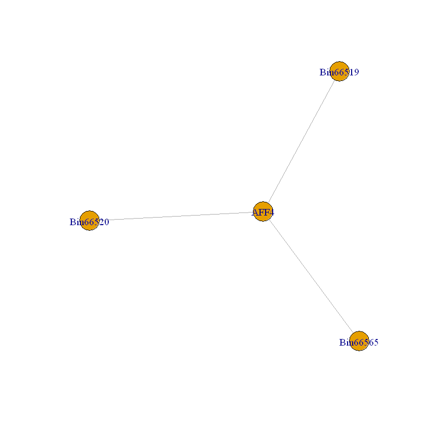

## neo4jshell

[`neo4jshell`](https://github.com/keithmcnulty/neo4jshell ) package requires the `cypher-shell` executable to be available locally. This package
proves `neo4j_query` for all kinds of cypher query in neo4j.

### 1. Install neo4jshell
```
devtools::install_github("keithmcnulty/neo4jshell")
```
### 2. Connect neo4j
The first step of Three packages driving neo4j is the same things to edite the following line in `conf/neo4j-server.properties`.
```
# Require (or disable the requirement of) auth to access Neo4j
dbms.security.auth_enabled=false
```
It just find out and delete `#` in the front.

After that, **You need to start neo4j before you connect with neo4j with `neo4jshell`.**  
```
GREG <- list(address = "bolt://localhost", uid = "neo4j", pwd = "password")      
SHELL_LOC = path.expand("F:/June21/chapter4/bin/cypher-shell.bat")
```
We just build a list to set credentials including informations about neo4j URL, username and password.   

**SHELL_LOC must be `neo4j/bin/cypher-shell.bat` file location.**

### 3. Cypher query with neo4jshell
We can execute a query string in Neo4J using cypher-shell and capture output by `neo4j_query()` function.

The `neo4j_query()` function takes several arguments:

arguments | description
--------------|---------------
con |  List containing three objects: bolt address, uid, pwd as character strings providing connection to the Neo4J server
qry |  Character string of the query or queries to be sent to Neo4J. Read queries should be single queries.
shell_path | If cypher-shell is not in the PATH system variable, the full local path to cypher-shell executable (eg '/Users/username/neo4j-community-3.5.8/bin/cypher-shell').

The results of `neo4j_query()` are data.frame format. For example to get all labels in GREG-minimum.
```
query <- "MATCH (n) RETURN distinct labels(n)"
neo4j_query(con = GREG, qry = query,shell_path = SHELL_LOC)
```
The results are as follows:  
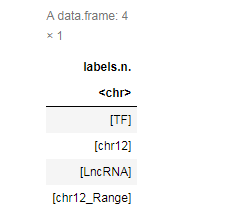

Example is to get where chr12 Range interaction DCP1B gene in chr12.
```
query = "
MATCH p=(n:chr12) -[r1:Inclusion]-> (m1) -[r2:Interaction]- (m2)
where n.Details contains 'DCP1B' and tointeger(n.Start) < 2000001
RETURN p limit 5"
neo4j_query(con = GREG, qry = query,shell_path = SHELL_LOC)
```
The results are as follows:  
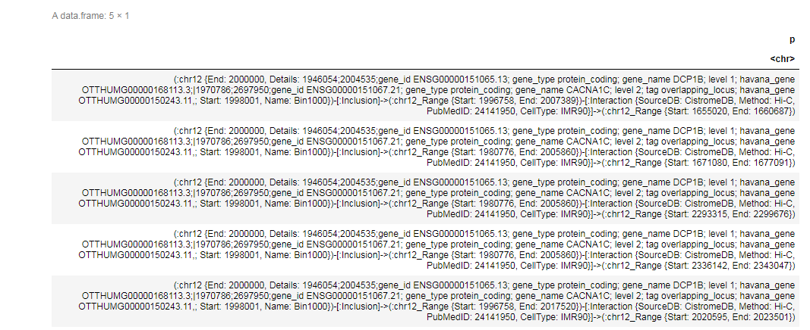

As you see, if we only ask return path, then it only give us a column line. We should return the path details. 
### 4. Convert graph in R

As usual, we use relationship of TF binding chr12 as example. Here we show you visualization by `igraph.`
You can see `RNeo4j` to get igraph package details.
```
query = "
MATCH p=(n:TF)-[r:Bind]->(m:chr12) RETURN n.Name, m.Name,r.CellType LIMIT 3"
G_neo4jshell <- neo4jshell::neo4j_query(con = GREG, qry = query,shell_path = SHELL_LOC)
G_neo4jshell
```
The data.frame shows like that:

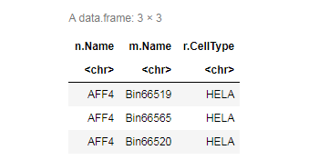

```
library(igraph)
ig <- graph.data.frame(G_neo4jshell,directed = F)
ig
plot(ig)
```
The results of `ig` and the picture show like that:

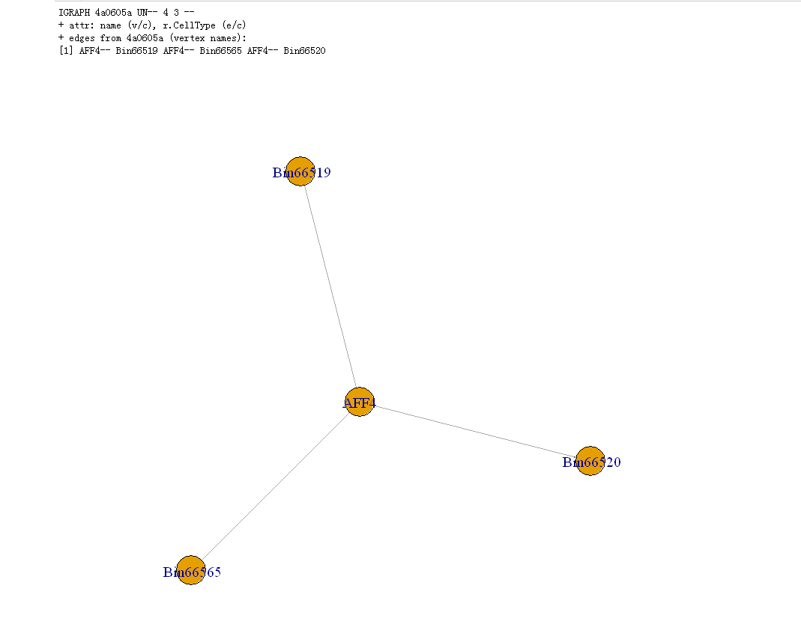

## neo4r

`neo4r` is the last package we want to discuss at this part. `neo4r` proves functions to get more details of results. Now,
let us to learn `neo4r`.

### Install neo4r
 Here prove two ways to install RNeo4j.
 
**Install from CRAN**
 ```
 install.packages("neo4r")
 ```
**Install from Github**
 ```
# install.packages("remotes")
remotes::install_github("neo4j-rstats/neo4r")
```
### 2. Connect neo4j
As we show at before, the first step of Three packages driving neo4j is the same things to edite the following line in `conf/neo4j-server.properties`.
```
# Require (or disable the requirement of) auth to access Neo4j
dbms.security.auth_enabled=false
```
It just find out and delete `#` in the front.

After that, **You need to start neo4j before you connect with neo4j with `neo4jshell`.**  
```
con <- neo4j_api$new(url = "http://localhost:7474",user = "neo4j", password = "xiaowei")
```
`neo4r` give a way to check whether you had connected neo4j.
```
con$ping()   
```
If the result is 200, then it means seccuss.

### 3. Cypher query with neo4r
`neo4r` prove function `call_neo4j` to query in neo4j.
The `call_neo4j()` function takes several arguments :

arguments | Description
----|-------
query | the cypher query
con | the connetion object
type | “rows” or “graph”: whether to return the results as a list of results in tibble, or as a graph object (with `$nodes` and `$relationships`)
output | the output format (R or json)
include_stats | whether or not to include the stats about the call
meta | whether or not to include the meta arguments of the nodes when calling with “rows”

Example still is to get all labels in GREG-minimum.

If we want results as a tibble, we set `type = "row"`.`
```
query <- "MATCH (n) RETURN distinct labels(n)" 
  call_neo4j(con, query=query,type = "row")
```
The data.frame shows like that:

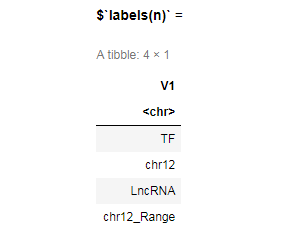

Example is to get where chr12 Range interaction DCP1B gene in chr12.
If we want result as a graph object or a list including two tibbles, we set `type = "graph"`.
```
query = "
MATCH p=(n:chr12) -[r1:Inclusion]-> (m1) -[r2:Interaction]- (m2)
where n.Details contains 'DCP1B' and tointeger(n.Start) < 2000001
RETURN p limit 5"
  call_neo4j(con, query=query,type = "graph")
```
The result is a list containing nodes and relationships tibbles.
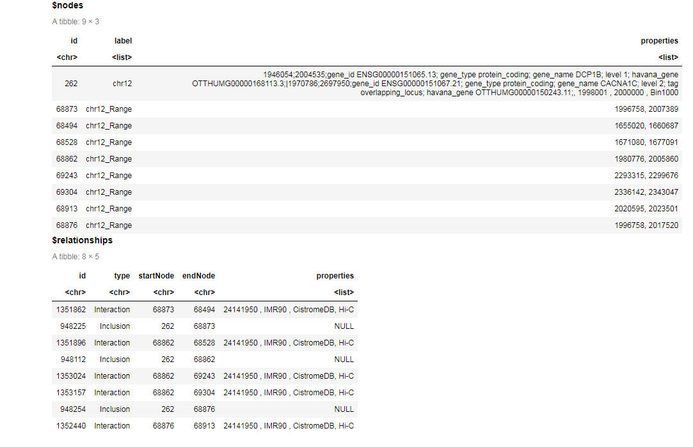

But if want to know more about what properties are, we can use other functions `unnest_nodes` 
and `unnest_nodes`. You can see at `Convert graph in R`.

### 4. Convert graph in R
**1. First, we use query neo4j using `call_neo4j` function to get a graph result. Example is relationship of one node Binding to other node.**
```
query = "
MATCH p=()-[r:Bind]->() RETURN p LIMIT 3"
G <- neo4r::call_neo4j(con, query=query,type = "graph")
G
```
The result is as follows:

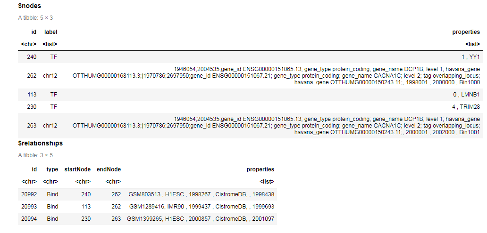

**2. Unnest the properties, it can help us get all nodes properties as columns if we need.**
```
# We'll just unnest the properties
library(dplyr)
library(purrr)
G$nodes <- G$nodes %>%
  unnest_nodes(what = "properties") #%>% #unnest_nodes() is one function to unnest a node in neo4j package.
    #We turn the nodes for  showing us gene name as node in graph.
  # select(id = id, label = Name)
head(G$nodes) 
```
Now, the properties column had been unnested.
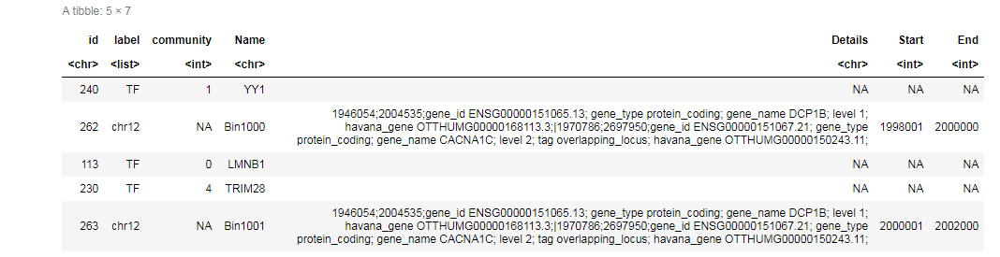

**3.  Turn the relationships**
```
G$relationships <- G$relationships %>%
  unnest_relationships() %>%
  select(from = startNode, to = endNode, label = type)
head(G$relationships)
```
The result like this:

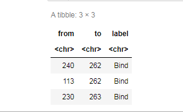

**4. Visualize with `visNetwork`**
`visNetwork` expects the following format:  
```
visNetwork(nodes = NULL, edges = NULL, dot = NULL, gephi = NULL,
  width = NULL, height = NULL, main = NULL, submain = NULL,
  footer = NULL, background = "rgba(0, 0, 0, 0)", ...)
```
The main arguments are nodes and edges.  

nodes: data.frame or a list with nodes informations.Needed at least colimn "id".

col| description
:---|:--------
id | id of the node, needed in edges information
label | label of the node
group | group of the node. Groups can be configure with visGroups
value | size of the node
title | tooltip of the node

edges:  data.frame or a list with edges informations. Needed at least columns "from"
and "to".

col | description
:----|:------
from | node id of begin of the edge
to | node id of end of the edge
label | label of the edge
value | size of the node
title | tooltip of the node

Plot `G` with visNetwork.
```
visNetwork::visNetwork(G$nodes, G$relationships)
```
The picture shows as following:
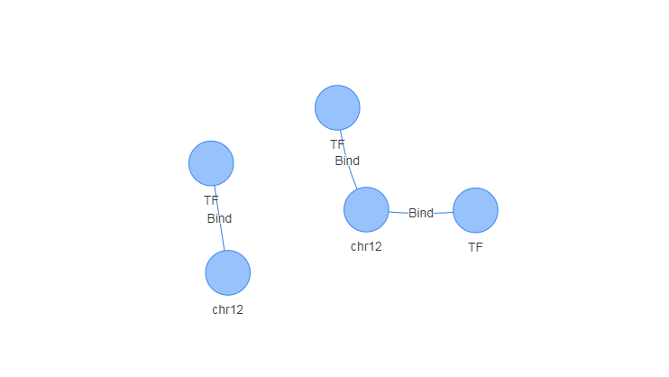 

**5. Visualize with `igraph`**
```
graph_object <- igraph::graph_from_data_frame(
  d = G$relationships, 
  directed = TRUE, 
  vertices = G$nodes
)
plot(graph_object)
```
The picture shows as following:
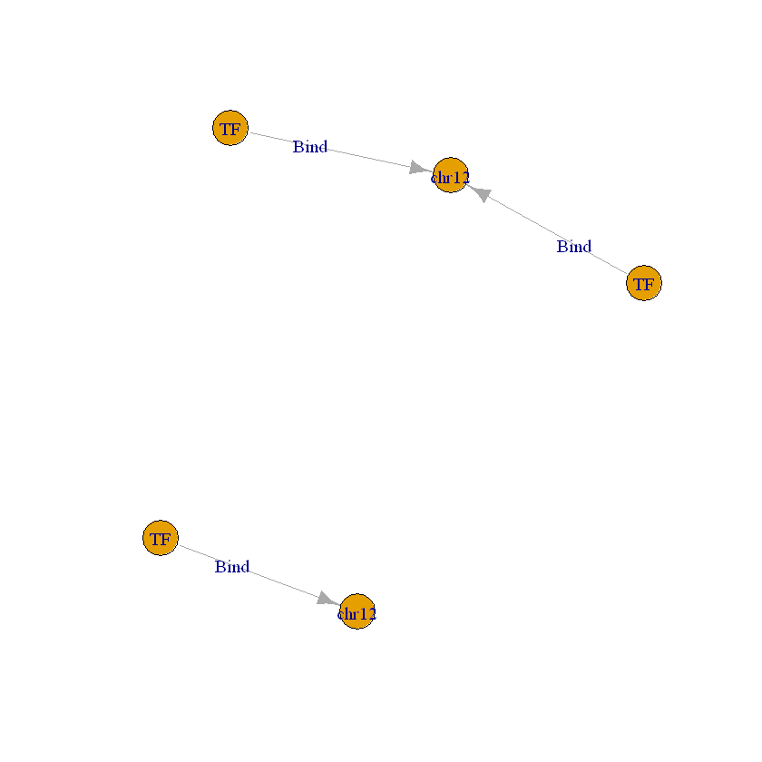

## Import CSV files to neo4j
After learned three packages query neo4j, you should be want to know how to use R to import data to neo4j.
We will talk about import data functions in `RNeo4j` and `neo4r` package.

### Build a new neo4j database in GREG.
In case we change something in GREG, we build other database to test import csv function in two packages.

1. Edite following line in `neo4j/conf/neo4j.cof`:
```
# The name of the database to mount
#dbms.active_database=GREG-minimum
dbms.active_database=4Dgenome
```
### Prepare CSV file
We chose 4DGenome interaction data for Homo sapiens(hg19) at https://4dgenome.research.chop.edu/Download.html. You can download at [here](https://4dgenome.research.chop.edu/Tables/4DGenome_HomoSapiens_hg19.txt).
```
#1. delete NA at row and select 500 interaction for test.
Genome_Homo <- read.table("4DGenome_HomoSapiens_hg19.txt",header = TRUE,sep = "\t")
Genome_Homo1 <- na.omit(Genome_Homo) #delete NA at row.
Genome_Homo1 <- Genome_Homo1[1:500,]

#2. Build node csv file.
colnames(Genome_Homo1)[10] = "CellTissue"  #Change Cell.Tissue colname because if colnames included character ".", it will get ERROR at import file step.
geneAlist <- Genome_Homo1[,c(7,1:3)]
geneBlist <- Genome_Homo1[,c(8,4:6)]
colnames(geneAlist) <- c('Gene','Chr','Start','End')
colnames(geneBlist) <- c('Gene','Chr','Start','End')
genelist <- rbind(geneAlist,geneBlist) #merge geneA and geneB
genelist <- dplyr::distinct(genelist) #delete duplicated rows

#3. Save as csv files.
write.csv(genelist,file="GeneList_4DGenome_Homo.csv",row.names = FALSE)
write.csv(Genome_Homo1,file="4DGenome_Homo.csv",row.names = FALSE)
```
### Import CSV file
#### RNeo4j
`newTransaction()` returns a transaction object. Both `appendCypher()` and `commit()` return NULL.

**1. Create node**
```
query = "CREATE (a:Node{Gene:{Gene_name}, Chr:{Chr_name}, Start:{Start_name}, End:{End_name}})"
t = newTransaction(graph)

for (i in 1:nrow(genelist)){
    Gene_name = genelist[i,]$Gene
    Chr_name = genelist[i,]$Chr
    Start_name = as.numeric(genelist[i,]$Start)
    End_name = as.numeric(genelist[i,]$End)
    
    appendCypher(t,
                query,
                Gene_name = Gene_name,
                Chr_name = Chr_name,
                Start_name = Start_name,
                End_name = End_name)
}
commit(t)
summary(graph)
```
Or you can chose `createNode()` to create nodes.
```
for (i in 1:nrow(genelist)){
    createNode(graph, "Node", 
                    Gene = genelist[i,]$Gene,
                    Chr = genelist[i,]$Chr,
                    Start = as.numeric(genelist[i,]$Start),
                    End = as.numeric(genelist[i,]$End))
}
```
**2. Check how many nodes are and what nodes labels are in 4Dgenome.**
```
RNeo4j::getLabel(graph)
```
You can get string `Node` as result.
```
query = "MATCH (n) RETURN count(n)" 
RNeo4j::cypher(graph, query = query )
```
It returns 652 which the same of `genelist` row number.

**3. Create relationships**
```
query = "MATCH (a:Node{Gene:{GeneA_name}, Chr:{ChrA_name}, Start:{StartA_name}, End:{EndA_name}}),
(b:Node{Gene:{GeneB_name}, Chr:{ChrB_name}, Start:{StartB_name}, End:{EndB_name}})
MERGE (a)-[r:Interaction{cellTissue:{cellTissue_name}, Detection_Method:{Detection_Method_name}, Pubmed_ID:{Pubmed_ID_name}}]-(b)
"


t = newTransaction(graph)

for (i in 1:nrow(Genome_Homo1)){
    GeneA_name = Genome_Homo1[i,]$Agene
    ChrA_name = Genome_Homo1[i,]$InteractorAChr
    StartA_name = as.numeric(Genome_Homo1[i,]$InteractorAStart)
    EndA_name = as.numeric(Genome_Homo1[i,]$InteractorAEnd)

    GeneB_name = Genome_Homo1[i,]$Bgene
    ChrB_name = Genome_Homo1[i,]$InteractorBChr
    StartB_name = as.numeric(Genome_Homo1[i,]$InteractorBStart)
    EndB_name = as.numeric(Genome_Homo1[i,]$InteractorBEnd)
    
    cellTissue_name = Genome_Homo1[i,]$CellTissue
    Detection_Method_name = Genome_Homo1[i,]$Detection_Method
    Pubmed_ID_name = Genome_Homo1[i,]$Pubmed_ID
    
    appendCypher(t,
                query,
                
                GeneA_name = GeneA_name,
                ChrA_name = ChrA_name,
                StartA_name = StartA_name,
                EndA_name = EndA_name,

                GeneB_name = GeneB_name,
                ChrB_name = ChrB_name,
                StartB_name = StartB_name,
                EndB_name = EndB_name,
    
                cellTissue_name = cellTissue_name,
                Detection_Method_name = Detection_Method_name,
                Pubmed_ID_name = Pubmed_ID_name)
}
commit(t)
summary(graph)
```
**4. Check how many relationships and what relationships are.**
```
#get all relationship types
query <- "CALL db.relationshipTypes()"
RNeo4j::cypher(graph,query)
```
Result is data.frame of Interaction relationshipTypes.
```
#count relationships
query <- "MATCH (n)-[r]->(m) RETURN count(r)"
RNeo4j::cypher(graph,query)
```
It returns 500 which the same of `Genome_Homo1` row number.

```
#query relationships
query <- "MATCH (n)-[r]->(m) RETURN n.Gene,m.Gene,r.cellTissue limit 3"
RNeo4j::cypher(graph,query)
```
The result is that:
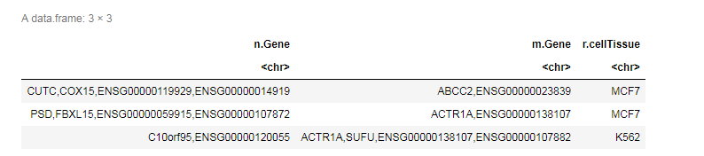  

**5. Remove all data in this graph database.**
```
#Remove all data in this graph database
query <- "match (n) detach delete n" 
cypher(graph,query)
```
Or you can delete `GREG/data/databases/4Dgenome` folder and restart neo4j.

#### neo4r
`neo4r` use `load_csv` to send an csv from an url to the Neo4J browser.

The args are :

arguments | Description
------------|--------------
on_load | the code to execute on load
con | the connexion object
url | the url of the csv to send
header | whether or not the csv has a header
periodic_commit | the volume for PERIODIC COMMIT
as | the AS argument for LOAD CSV
format | the format of the result
include_stats | whether or not to include the stats
meta | whether or not to return the meta information

**Notes:** Put all csv files you want import to neo4j in `neo4j/import` directory.

**1. Create node**
```
# Create the query that will create the nodes
on_load_query <- 'CREATE (n:Node) 
    SET n=csvLine,
        n.Chr = csvLine.Chr, 
        n.Gene = csvLine.Gene, 
        n.Start = toInteger(csvLine.Start),
        n.End = toInteger(csvLine.End); '
# Send the csv 
load_csv(url = "file:///GeneList_4DGenome_Homo.csv", 
         con = con, header = TRUE, periodic_commit = 50, 
         as = "csvLine", on_load = on_load_query)
```
You will get some informations:

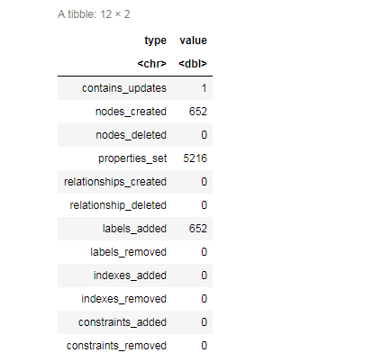

**2. Create relationship**
```
on_load_query <- '
MATCH (a:Node { Chr:csvLine.InteractorAChr, Gene: csvLine.Agene, Start:toFloat(csvLine.InteractorAStart),End:toFloat(csvLine.InteractorAEnd) }),
(b:Node { Chr:csvLine.InteractorBChr, Gene: csvLine.Bgene, Start:toFloat(csvLine.InteractorBStart),End:toFloat(csvLine.InteractorBEnd) })
MERGE (a)-[r:Interaction{cellTissue:csvLine.CellTissue, Detection_Method:csvLine.Detection_Method, Pubmed_ID:csvLine.Pubmed_ID}]-(b)'

# Send the csv 
load_csv(url = "file:///4DGenome_Homo.csv", 
         con = con, header = TRUE, periodic_commit = 50, 
         as = "csvLine", on_load = on_load_query)
```
You will get some informations:

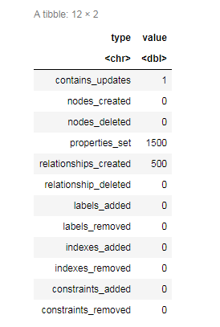		 
